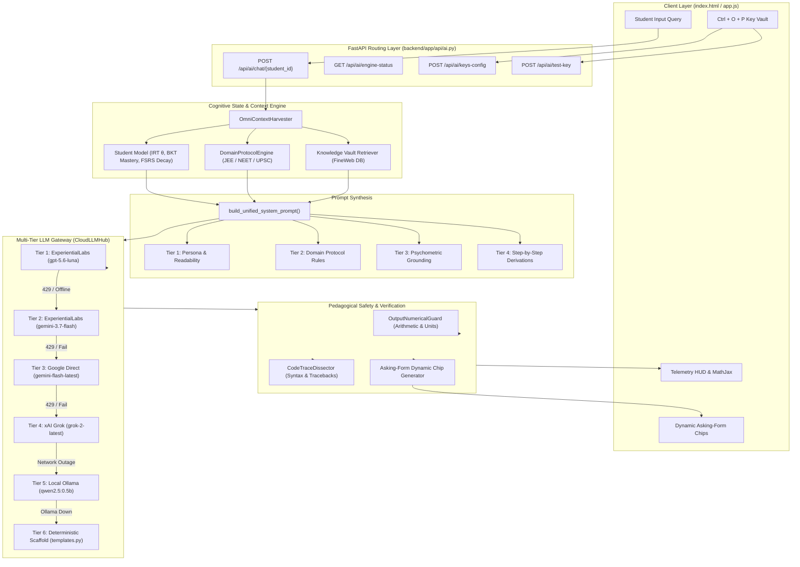

# 🧠 APEX Cognitive Mentor Engine: Complete Technical Architecture

> **System Status**: Production Ready | Multi-Tier Resilient | Psychometrically Grounded  
> **Primary API Gateway**: ExperientialLabs (`https://api.experientiallabs.ai/v1`) & Google Gemini / xAI Grok  
> **Offline Engine**: Ollama (`qwen2.5:0.5b`) & Deterministic Mathematical Scaffold  

---

## 1. Executive Summary & Design Philosophy

The **APEX Cognitive Mentor Studio** is not a generic conversational chatbot. It is a **domain-aware, psychometrically calibrated pedagogical intelligence engine** built specifically for competitive examination aspirants (**IIT-JEE, NEET, UPSC**) and general STEM learners.

### Core Architectural Mandates:
1. **Zero-Crash Resilience (Six-Tier Cascade)**: A student must *never* see an error bubble, loading crash, or HTTP failure. Every query flows through a prioritized cascade of cloud models, edge local models, and deterministic pedagogical templates.
2. **Pure Concept Definitions First**: When asked a conceptual query (e.g. *"What is gravity?"*), the AI provides a clean, rigorous, syllabus-aligned definition first with LaTeX mathematics ($$...$$), completely devoid of unsolicited bureaucracy, canned menus, or break reminders.
3. **No Unsolicited Hallucinated Files**: The AI references external readings or Knowledge Vault files *only* when authentic database records match the query. If no match exists, no fake files are suggested.
4. **Three Interactive Asking-Form Chips**: Every conceptual response is followed by three dynamically generated next-step questions (Derivation deep dive, syllabus roadmap transition, and exam practice challenge).
5. **Psychometric Calibration**: The explanation complexity adapts to the student's latent ability ($\theta \in [-3.0, +3.0]$) calculated via Item Response Theory (2PL IRT) and Bayesian Knowledge Tracing (BKT).

---

## 2. End-to-End System Architecture



---

## 3. The 6-Tier Multi-Provider Failover Matrix

The heart of APEX's reliability is `CloudLLMHub` in [`backend/app/ai/cloud_llm.py`](file:///d:/UNCLECHAN/generate/backend/app/ai/cloud_llm.py).

| Tier | Provider & Model | Protocol / Endpoint | Role & Behavior |
| :---: | :--- | :--- | :--- |
| **Tier 1** | **ExperientialLabs**<br>`gpt-5.6-luna` | OpenAI Compatible<br>`https://api.experientiallabs.ai/v1` | **Primary Frontier**: Specialized high-velocity reasoning model for advanced mathematical derivations and multi-step STEM proofs. |
| **Tier 2** | **ExperientialLabs**<br>`gemini-3.7-flash` | OpenAI Compatible<br>`https://api.experientiallabs.ai/v1` | **Gateway Failover**: Instant seamless backup if Luna is rate-limited or busy. Runs on same Experiential credits. |
| **Tier 3** | **Google Cloud Frontier**<br>`gemini-flash-latest` | Google REST API v1beta<br>`generativelanguage.googleapis.com` | **Active Direct Primary**: High-speed multimodal engine providing sub-second pedagogical answers. |
| **Tier 4** | **xAI Frontier**<br>`grok-2-latest` | OpenAI Compatible<br>`api.x.ai/v1/chat/completions` | **Socratic Dialectic Engine**: Robust for rigorous edge cases, counter-intuitive physics, and humanities debates. |
| **Tier 5** | **Local Edge Engine**<br>`qwen2.5:0.5b` | Ollama HTTP API<br>`http://localhost:11434` | **Zero-Internet Fallback**: Ultra-compact 0.5B parameter model executing on Drive D for offline study. |
| **Tier 6** | **Deterministic Scaffold**<br>`templates.py` | Local Python Runtime Memory | **Zero-Crash Failsafe**: Pre-compiled curriculum templates for mechanics, optics, gravitation, thermodynamics with LaTeX math. |

### Fast Circuit Breakers:
- When any model returns HTTP 401, 403, or 429, the circuit breaker marks that model exhausted for a set window (15s to 600s), avoiding cascading latency for the user.
- The router instantly evaluates the next tier without hanging or timing out.

---

## 4. Psychometric Grounding & Cognitive State

Unlike standard LLM interfaces, APEX tailors the explanation's pedagogical difficulty according to real-time student models:

### 1. Item Response Theory (IRT 2PL Model)
The student's latent cognitive capability is tracked as $\theta \in [-3.0, +3.0]$:
$$P(Y = 1 | \theta, \alpha, \beta) = \frac{1}{1 + e^{-\alpha(\theta - \beta)}}$$
- **Foundational Tier ($\theta < -0.5$)**: The system prompt instructs the LLM to use everyday physical analogies, step-by-step scaffolds, and avoid dense formalisms.
- **Proficient Tier ($-0.5 \le \theta \le 0.7$)**: Balanced conceptual depth with standard exam notation.
- **Advanced Mastery ($\theta > 0.7$)**: Direct, rigorous proofs, dimensional analysis shortcuts, and Olympiad/JEE Advanced problem variations.

### 2. Bayesian Knowledge Tracing (BKT)
Tracks student concept mastery $P(L_t)$ across prerequisite trees:
$$P(L_{t+1}) = P(L_t | \text{Obs}) + (1 - P(L_t | \text{Obs})) \cdot P(T)$$
Identifies when a student has a "prerequisite gap" (e.g., struggling with Rotational Torque because Vector Cross Products are unmastered) and instructs the LLM to patch the root cause.

### 3. FSRS Memory Decay
Computes retrieval probability $R = e^{-t / S}$ to remediate concepts decaying in memory.

---

## 5. Domain Protocol Engine (`domain_protocols.py`)

Every student belongs to an exam domain with immutable pedagogical rules:

### 🚀 1. IIT-JEE Protocol
- **Focus**: Pure physics mechanics, electromagnetism, organic reaction mechanisms, physical chemistry, differential calculus.
- **Invariants**: Strict dimensional checks $[M L T^{-2}]$, algebraic sign tracking, and step-by-step mathematical derivations.
- **Tone**: Analytical, mathematically rigorous, focused on JEE Advanced edge cases.

### 🧬 2. NEET Protocol
- **Focus**: Medical entrance, biological systems, chemical equilibrium, human physiology, botanical taxonomy.
- **Invariants**: NCERT textbook primacy, morphological accuracy, and clinical mnemonics.
- **Cross-Disciplinary Warning**: If a JEE student asks about photosynthesis, the mentor answers cleanly while reminding them of their enrolled track.

### 🏛️ 3. UPSC Protocol
- **Focus**: General Studies Paper I - IV, Polity, Economy, Geography, International Relations, Ethics.
- **Invariants**: Multi-dimensional analysis (Constitutional, Economic, Sociological), balanced neutral perspective, and reference to government policies and Supreme Court precedents.

### 🔬 4. GENERAL_STEM Protocol
- Universal scientific inquiry with strict verification and zero hand-waving.

---

## 6. OmniContext Harvester & Knowledge Vault

Located in [`backend/app/ai/omni_context.py`](file:///d:/UNCLECHAN/generate/backend/app/ai/omni_context.py):

1. **Context Harvesting**: Pulls active student exam, target milestones, recent quiz attempts, wrong-answer rationales, and current mastery levels.
2. **Knowledge Vault Retriever**:
   - Queries the local SQLite curriculum database for authentic FineWeb syllabus readings matching keywords.
   - Attaches verified formula previews ($I = I_{cm} + Md^2$).
   - **Critical Integrity Rule**: If no authentic database record matches the query, `vault_readings` returns `None`. **No fake or hallucinated files are ever suggested to the student.**

---

## 7. Dynamic Asking-Form Interactive Chips

Below every response, the system presents three interactive options in asking form:

```html
👉 Choose Next Step:
[ 📐 Would you like to deep dive into the derivation of [Topic]? → ]
[ 🗺️ How does [Topic] connect to the next topic in my syllabus? → ]
[ 🎯 Would you like to solve a practice [Exam] question on [Topic]? → ]
```

### Multi-Turn Context Continuity:
- In [`index.html`](file:///d:/UNCLECHAN/generate/index.html), the chat handler automatically passes a rolling history slice (`history: messages.slice(-6)`) to `/api/ai/chat/{student_id}`.
- When the student clicks a chip like *"Would you like to deep dive into the derivation?"*, the LLM knows the exact context of the previous turn and proceeds with the mathematical proof without asking the user to repeat the topic.

---

## 8. Pedagogical Safety Guards

Located in [`backend/app/student_model/numerical_guards.py`](file:///d:/UNCLECHAN/generate/backend/app/student_model/numerical_guards.py) & [`backend/app/ai/socratic_agents.py`](file:///d:/UNCLECHAN/generate/backend/app/ai/socratic_agents.py):

1. **`OutputNumericalGuard`**: Scans LLM outputs for arithmetic errors, dimensional inconsistencies, and accidental answer leakages during active quiz questions.
2. **`CodeTraceDissector`**: For programming and algorithmic queries, it parses syntax, explains stack traces, and highlights logic errors without spoiling the solution.
3. **Pure Chat Output Protection**: Break alerts and cognitive fatigue notifications are isolated to diagnostic HUD telemetry and completely suppressed from the student chat window to maintain clean, uninterrupted learning.

---

## 9. Bring Your Own Key (BYOK) Dynamic Key Vault

Students and administrators can hot-swap API keys at runtime without restarting the server:

* **Trigger**: Press **`Ctrl + O + P`** anywhere on the dashboard.
* **Supported Providers**: ExperientialLabs (`gpt-5.6-luna`), Google Gemini, xAI Grok, OpenRouter, and custom OpenAI-compatible endpoints.
* **Live Connectivity Testing**: Click **🧪 Test Key** to send a live validation ping and inspect response codes and token usage breakdown.
* **Persistence**: Automatically updates [`.env`](file:///d:/UNCLECHAN/generate/.env) when *"Persist changes to local .env file"* is checked.

---

## 10. Codebase Structure Reference

```
backend/app/
├── ai/
│   ├── cloud_llm.py           # Multi-provider gateway (Experiential, Gemini, Grok, BYOK)
│   ├── domain_protocols.py    # Formal protocols (JEE, NEET, UPSC, GENERAL_STEM)
│   ├── local_llm.py           # Local Ollama client & clean conceptual prompt builder
│   ├── omni_context.py        # Student context harvester & Knowledge Vault retriever
│   ├── socratic_agents.py     # Pedagogical policy router & in-chat quiz agent
│   ├── templates.py           # Deterministic offline fail-safe templates
│   ├── intent_classifier.py   # Query classifier (Solve vs Concept vs Chat)
│   └── explanation.py         # Formative explanation generators
├── api/
│   └── ai.py                  # API endpoints (/chat, /engine-status, /keys-config, /test-key)
├── student_model/
│   ├── irt.py                 # 2PL Item Response Theory implementation
│   ├── bkt.py                 # Bayesian Knowledge Tracing engine
│   └── numerical_guards.py    # Output safety & arithmetic verification
└── curriculum/
    ├── exambench_service.py   # Competitive exam benchmark questions
    └── hierarchy.py           # Curriculum syllabus tree (Physics, Chem, Math, Bio)
```

---

## 11. Environment Configuration (`.env`)

```env
# ── ExperientialLabs / Custom Gateway (Tier 1 & 2) ───────────
PREFERRED_AI_PROVIDER=experiential
CUSTOM_AI_PROVIDER=ExperientialLabs
CUSTOM_AI_BASE_URL=https://api.experientiallabs.ai/v1
CUSTOM_AI_MODEL=gpt-5.6-luna
EXPLABS_API_KEY=your_key_here

# ── Google Cloud Frontier Layer (Tier 3) ─────────────────────
GEMINI_API_KEY=your_gemini_key_here
GEMINI_MODEL=gemini-flash-latest
USE_GEMINI_POLISH=true
GEMINI_TIMEOUT_SECONDS=15.0

# ── xAI Frontier Layer (Tier 4) ──────────────────────────────
GROK_API_KEY=your_grok_key_here
GROK_MODEL=grok-2-latest
GROK_TIMEOUT_SECONDS=15.0

# ── Local Edge Ollama Engine (Tier 5) ────────────────────────
OLLAMA_BASE_URL=http://localhost:11434
OLLAMA_MODEL=qwen2.5:0.5b
USE_OLLAMA_POLISH=true
OLLAMA_TIMEOUT_SECONDS=35.0

# ── Offline Deterministic Fallback (Tier 6) ───────────────────
LOCAL_AI_ENABLED=true
```

---
*Document Version: 2.4.0 | Maintained by APEX AI Cognitive Architecture Team*
