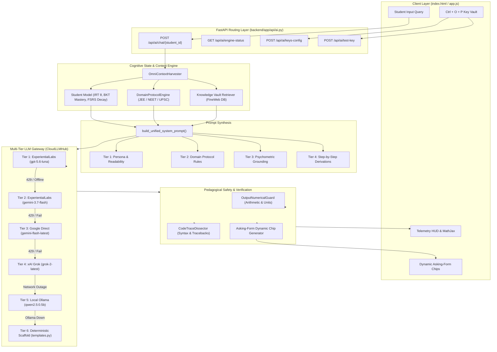

# 🧠 APEX Cognitive Mentor Engine: Complete Technical Architecture

> **System Status**: Production Ready | Multi-Tier Resilient | Psychometrically Grounded  
> **Primary API Gateway**: ExperientialLabs (`https://api.experientiallabs.ai/v1`) & Google Gemini / xAI Grok  
> **Offline Engine**: Ollama (`qwen2.5:0.5b`) & Deterministic Mathematical Scaffold  

---

## 1. Executive Summary & Design Philosophy

The **APEX Cognitive Mentor Studio** is not a generic conversational chatbot. It is a **domain-aware, psychometrically calibrated pedagogical intelligence engine** built specifically for competitive examination aspirants (**IIT-JEE, NEET, UPSC**) and general STEM learners.

### Core Architectural Mandates:
1. **Zero-Crash Resilience (Six-Tier Cascade)**: A student must *never* see an error bubble, loading crash, or HTTP failure. Every query flows through a prioritized cascade of cloud models, edge local models, and deterministic pedagogical templates.
2. **Pure Concept Definitions First**: When asked a conceptual query (e.g. *"What is gravity?"*), the AI provides a clean, rigorous, syllabus-aligned definition first with LaTeX mathematics ($$...$$), completely devoid of unsolicited bureaucracy, canned menus, or break reminders.
3. **No Unsolicited Hallucinated Files**: The AI references external readings or Knowledge Vault files *only* when authentic database records match the query. If no match exists, no fake files are suggested.
4. **Three Interactive Asking-Form Chips**: Every conceptual response is followed by three dynamically generated next-step questions (Derivation deep dive, syllabus roadmap transition, and exam practice challenge).
5. **Psychometric Calibration**: The explanation complexity adapts to the student's latent ability ($\theta \in [-3.0, +3.0]$) calculated via Item Response Theory (2PL IRT) and Bayesian Knowledge Tracing (BKT).

---

## 2. End-to-End System Architecture

---

## 3. The 6-Tier Multi-Provider Failover Matrix

The heart of APEX's reliability is `CloudLLMHub` in [`backend/app/ai/cloud_llm.py`](file:///d:/UNCLECHAN/generate/backend/app/ai/cloud_llm.py).

| Tier | Provider & Model | Protocol / Endpoint | Role & Behavior |
| :---: | :--- | :--- | :--- |
| **Tier 1** | **ExperientialLabs** `gpt-5.6-luna` | OpenAI Compatible `https://api.experientiallabs.ai/v1` | **Primary Frontier**: Specialized high-velocity reasoning model for advanced mathematical derivations and multi-step STEM proofs. |
| **Tier 2** | **ExperientialLabs** `gemini-3.7-flash` | OpenAI Compatible `https://api.experientiallabs.ai/v1` | **Gateway Failover**: Instant seamless backup if Luna is rate-limited or busy. Runs on same Experiential credits. |
| **Tier 3** | **Google Cloud Frontier** `gemini-flash-latest` | Google REST API v1beta `generativelanguage.googleapis.com` | **Active Direct Primary**: High-speed multimodal engine providing sub-second pedagogical answers. |
| **Tier 4** | **xAI Frontier** `grok-2-latest` | OpenAI Compatible `api.x.ai/v1/chat/completions` | **Socratic Dialectic Engine**: Robust for rigorous edge cases, counter-intuitive physics, and humanities debates. |
| **Tier 5** | **Local Edge Engine** `qwen2.5:0.5b` | Ollama HTTP API `http://localhost:11434` | **Zero-Internet Fallback**: Ultra-compact 0.5B parameter model executing on Drive D for offline study. |
| **Tier 6** | **Deterministic Scaffold** `templates.py` | Local Python Runtime Memory | **Zero-Crash Failsafe**: Pre-compiled curriculum templates for mechanics, optics, gravitation, thermodynamics with LaTeX math. |

### Fast Circuit Breakers:
- When any model returns HTTP 401, 403, or 429, the circuit breaker marks that model exhausted for a set window (15s to 600s), avoiding cascading latency for the user.
- The router instantly evaluates the next tier without hanging or timing out.

---

## 4. Psychometric Grounding & Cognitive State

Unlike standard LLM interfaces, APEX tailors the explanation's pedagogical difficulty according to real-time student models:

### 1. Item Response Theory (IRT 2PL Model)
The student's latent cognitive capability is tracked as $\theta \in [-3.0, +3.0]$:
$$P(Y = 1 | \theta, \alpha, \beta) = \frac{1}{1 + e^{-\alpha(\theta - \beta)}}$$
- **Foundational Tier ($\theta < -0.5$)**: The system prompt instructs the LLM to use everyday physical analogies, step-by-step scaffolds, and avoid dense formalisms.
- **Proficient Tier ($-0.5 \le \theta \le 0.7$)**: Balanced conceptual depth with standard exam notation.
- **Advanced Mastery ($\theta > 0.7$)**: Direct, rigorous proofs, dimensional analysis shortcuts, and Olympiad/JEE Advanced problem variations.

### 2. Bayesian Knowledge Tracing (BKT)
Tracks student concept mastery $P(L_t)$ across prerequisite trees:
$$P(L_{t+1}) = P(L_t | \text{Obs}) + (1 - P(L_t | \text{Obs})) \cdot P(T)$$
Identifies when a student has a "prerequisite gap" (e.g., struggling with Rotational Torque because Vector Cross Products are unmastered) and instructs the LLM to patch the root cause.

### 3. FSRS Memory Decay
Computes retrieval probability $R = e^{-t / S}$ to remediate concepts decaying in memory.

---

