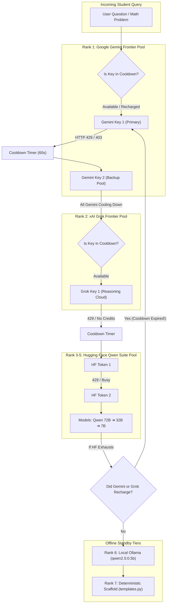

# 🧠 APEX Cognitive Mentor Engine: Complete Technical Architecture

> **System Status**: Production Ready | Multi-Key Pool & Auto-Recharge | Psychometrically Grounded  
> **Primary Cloud Frontier Pool**: Google Gemini (`gemini-3.6-flash`, `gemini-3.7-flash` Multi-Key Pool)  
> **Reasoning Cloud Frontier**: xAI Grok (`grok-2-latest`)  
> **Serverless Cloud Suite Pool**: Hugging Face Qwen 2.5 (`72B` ➔ `32B` ➔ `7B` Multi-Token Pool)  
> **Offline Engine**: Ollama (`qwen2.5:0.5b`) & Deterministic Mathematical Scaffold  

---

## 1. Executive Summary & Design Philosophy

The **APEX Cognitive Mentor Studio** is a **domain-aware, psychometrically calibrated pedagogical intelligence engine** built specifically for competitive examination aspirants (**IIT-JEE, NEET, UPSC**) and general STEM learners.

### Core Architectural Mandates:
1. **Zero-Crash Resilience with Multi-Key Pools & Auto-Recharge**: Every tier maintains a pool of API keys with intelligent cooldown timers. When an individual key hits rate limits (HTTP 429), it cools down (e.g. 60s) while the system immediately fails over to the next key. The moment the cooldown expires, the key is **automatically recharged and re-promoted back to Rank 1**.
2. **Top-Down Priority on Every Query**: If the system is currently using a lower tier (e.g. Rank 3 Hugging Face) and a higher-tier key (e.g. Rank 1 Gemini) completes its cooldown, the engine **immediately returns to Rank 1** rather than falling further down.
3. **Pure Concept Definitions First**: Conceptual queries receive a clean, rigorous, syllabus-aligned definition first with LaTeX mathematics ($$...$$), completely devoid of unsolicited bureaucracy, canned menus, or break reminders.
4. **No Unsolicited Hallucinated Files**: The AI references external readings or Knowledge Vault files *only* when authentic database records match the query.
5. **Three Interactive Asking-Form Chips**: Every conceptual response is followed by three dynamically generated next-step questions (Derivation deep dive, syllabus roadmap transition, and exam practice challenge).
6. **Psychometric Calibration**: The explanation complexity adapts to the student's latent ability ($\theta \in [-3.0, +3.0]$) calculated via Item Response Theory (2PL IRT) and Bayesian Knowledge Tracing (BKT).

---

## 2. Multi-Key Pool & Auto-Recharge Architecture



---

## 3. The 7-Tier Power-Ranked Failover Hierarchy

The heart of APEX's reliability is [`CloudLLMHub`](file:///d:/UNCLECHAN/generate/backend/app/ai/cloud_llm.py) backed by [`KeyTracker`](file:///d:/UNCLECHAN/generate/backend/app/ai/cloud_llm.py):

| Rank | Model Identifier | Provider / Pool | Capabilities & Role |
| :---: | :--- | :--- | :--- |
| **Rank 1** | **Google Gemini Frontier Pool**<br>`gemini-3.6-flash`, `gemini-3.7-flash` | Multi-Key Pool (Keys 1 & 2) | **Frontier Multimodal Cloud**: Ultra-fast latency (<600ms), 200 OK verified, automatic key-rotation on rate limits, and auto-recharge. |
| **Rank 2** | **xAI Grok**<br>`grok-2-latest` | xAI Cloud (`api.x.ai/v1`) | **Frontier Reasoning Cloud**: Deep Socratic analysis, rigorous counter-examples, and multi-step deduction. |
| **Rank 3** | **Qwen 2.5 72B Instruct**<br>`Qwen/Qwen2.5-72B-Instruct` | Multi-Token HF Router | **Flagship 72B Open-Weights**: Massive 72 Billion parameter capacity for complex mathematical proofs. |
| **Rank 4** | **Qwen 2.5 Coder 32B**<br>`Qwen/Qwen2.5-Coder-32B-Instruct` | Multi-Token HF Router | **Heavy 32B Code & Logic Engine**: High-speed mathematical calculations and structured derivations. |
| **Rank 5** | **Qwen 2.5 Coder 7B**<br>`Qwen/Qwen2.5-Coder-7B-Instruct` | Multi-Token HF Router | **Fast 7B Cloud Edge**: Rapid fallback ensuring immediate response under heavy router load. |
| **Rank 6** | **Local Ollama**<br>`qwen2.5:0.5b` | Ollama HTTP (`localhost:11434`) | **Local Edge Engine**: Runs entirely offline on the client machine when no internet connection is present. |
| **Rank 7** | **Pedagogical Scaffold**<br>`templates.py` | Local In-Memory Engine | **Zero-Crash Math Guarantee**: Pre-compiled curriculum templates with exact formulas ($$...$$) and FineWeb readings. |

### How the Auto-Recharge System Works:
1. **Per-Key State Machine**: Every key in the pool has its own `KeyTracker` with `exhausted_until`, `failure_count`, and `remaining_cooldown`.
2. **Non-Blocking Failover**: If Key 1 receives HTTP 429, it is marked with a 60-second cooldown (`exhausted_until = now + 60.0`). The system instantly switches to Key 2 without waiting or dropping requests.
3. **Immediate Re-Promotion**: On every new query, the engine inspects Key 1 first. If `time.time() >= exhausted_until`, Key 1 has **recharged** and is immediately selected.
4. **Mid-Flight Recovery**: If the system is currently executing on Rank 3 (Hugging Face) and Hugging Face experiences an error, before dropping to Rank 6 or 7, the engine re-checks Rank 1. If Rank 1's cooldown has finished, it springs straight back to Rank 1!

---

## 4. Environment Configuration (`.env`)

```env
# ── Rank 1: Google Gemini Frontier Pool (Auto-Failover & Auto-Recharge) ────
GEMINI_API_KEYS=your_gemini_api_key_1,your_gemini_api_key_2
GEMINI_API_KEY=your_gemini_api_key_1
GEMINI_MODEL=gemini-3.6-flash
GEMINI_TIMEOUT_SECONDS=4.5

# ── Rank 2: xAI Grok Frontier Reasoning ───────────────────────────────────
GROK_API_KEYS=your_grok_api_key_1
GROK_API_KEY=your_grok_api_key_1
GROK_MODEL=grok-2-latest
GROK_TIMEOUT_SECONDS=4.0

# ── Rank 3, 4, 5: Hugging Face Serverless Qwen Suite Pool ─────────────────
HF_TOKENS=your_hf_token_1,your_hf_token_2
HF_TOKEN=your_hf_token_1
HUGGINGFACE_API_KEY=your_hf_token_1
HF_ROUTER_BASE_URL=https://router.huggingface.co/v1
HF_QWEN_72B_MODEL=Qwen/Qwen2.5-72B-Instruct
HF_QWEN_32B_MODEL=Qwen/Qwen2.5-Coder-32B-Instruct
HF_QWEN_7B_MODEL=Qwen/Qwen2.5-Coder-7B-Instruct

# ── Cooldown & Auto-Recharge Settings (Seconds) ───────────────────────────
AI_COOLDOWN_RATE_LIMIT=60.0
AI_COOLDOWN_QUOTA=300.0

# ── Rank 6: Local Edge Ollama Engine ──────────────────────────────────────
LOCAL_AI_ENABLED=true
OLLAMA_BASE_URL=http://localhost:11434
OLLAMA_MODEL=qwen2.5:0.5b

# ── Rank 7: Zero-Crash Deterministic Mathematical Scaffold ────────────────
USE_GEMINI_POLISH=true
```

---

## 5. Humanized Cognitive Grounding & Mistake Forensics (Zero Raw ID Guarantee)

To create an authentic pedagogical mentor experience, APEX implements an invariant: **Zero Internal Database ID Leakage**. Aspirants must never be confronted with raw database keys like `pHQ-1234`, `q_5`, or `c_22`.

### Telemetry Pipeline:
1. **`OmniContextHarvester` Extraction**:
   - Queries the student's most recent exam attempt from SQLite.
   - Resolves all questions to their rich pedagogical dimensions: **Human Topic Name**, **Chapter**, **Concept Name**, **Question Stem & Context**, **Options (A, B, C, D)**, **Student Chosen Option**, **Correct Option**, **Distractor Trap Rationale**, and **Step-by-Step Derivations**.
2. **Grounding Block Sanitization**:
   - `omni_context.py` structures a clean markdown block with no database IDs.
   - The unified system prompt strictly instructs the LLM:
     > *"NEVER reference raw database question codes (e.g., pHQ-1234, q_1, c_7). Always refer to questions by their human topic, chapter, and concept name."*
3. **Cognitive Trap Diagnostics**:
   - Explains *why* the student selected their distractor (e.g. sign error, forgetting $g_{\text{eff}}$, confusing velocity with acceleration).
   - Provides clean step-by-step KaTeX resolutions with LaTeX formulas ($$...$$).

---

## 6. AI Mentor Structured Cards Architecture (`test_review` & `quiz`)

Responses from `/api/ai/coach` and `/api/ai/chat` can return an optional, strongly-typed `structured_card` payload that the frontend automatically renders as an interactive, gamified widget:

### 1. `test_review` Card Contract:
```json
{
  "type": "test_review",
  "title": "Last Test Performance Breakdown",
  "score_pct": 75.0,
  "total_questions": 4,
  "correct_count": 3,
  "breakdown": [
    {
      "topic": "Physics - Electrostatics",
      "concept": "Electric Field on Axis of Ring",
      "status": "correct",
      "stem": "What is the electric field at the center of a uniformly charged ring?"
    },
    {
      "topic": "Physics - Mechanics",
      "concept": "Rotational Kinetic Energy",
      "status": "incorrect",
      "chosen": "A",
      "correct": "C",
      "distractor_note": "Confused moment of inertia of disc with solid cylinder"
    }
  ],
  "action_prompt": "Retest Mistakes Now",
  "action_intent": "retest"
}
```
- **UI Rendering**: Renders a glowing radial/progress score meter, color-coded question pills, specific cognitive mistake tags, and a prominent **"🎯 Retest Mistakes Drill"** 1-click button.
- **Immediate Retest Action**: Clicking the button automatically triggers a diagnostic drill prioritizing the student's exact missed concepts.

### 2. `quiz` Card Contract:
- Renders an interactive multiple-choice card inside the mentor chat stream with options A, B, C, and D.
- Aspirants can click their answer directly inside the chat window for immediate validation and animated KaTeX explanation.

---

## 7. Multimodal PDF Ingestion & Dynamic Vault Evolution

APEX integrates a document ingestion pipeline (`backend/app/curriculum/pdf_ingestor.py` and `vault_augmenter.py`) allowing educators or students to upload notes, papers, or textbooks:
- **Fast Text Parsing**: Ingests multi-page PDFs using PyMuPDF (`fitz`) with automatic layout and section boundary detection.
- **Frontier LLM Extraction**: Extracts structured concepts, definitions, prerequisites, and competitive MCQs (with distractors and KaTeX explanations) adhering to Pydantic schemas.
- **Dynamic Vault Augmentation**: Checks for semantic duplicates in `apex.db`, registers newly discovered concepts, and stores new generated MCQs with instant Knowledge Vault visualization.

---

## 8. Live Diagnostics & API Endpoints

- **`GET /api/ai/engine-status`**: Returns live active tier, individual key pool status (masked key names, ready/cooling-down states, remaining seconds).
- **`GET /api/ai/keys-config`**: Returns full masked configuration for the BYOK modal (`Ctrl + O + P`).
- **`POST /api/ai/keys-config`**: Hot-swaps keys or comma-separated key pools at runtime without restarting the server.
- **`POST /api/ai/test-key`**: Performs an isolated live lightweight validation ping on any single key.
- **`POST /api/materials/upload-pdf`**: Multipart file upload endpoint for PDF parsing and vault augmentation.
- **`POST /api/materials/generate-from-text`**: Generates concepts & MCQs directly from raw syllabus text.
- **`GET /api/materials/augmented-vault`**: Inspects dynamically ingested vault concepts and generated quiz items.

---
*Document Version: 4.5.0 | Maintained by APEX AI Cognitive Architecture Team*

