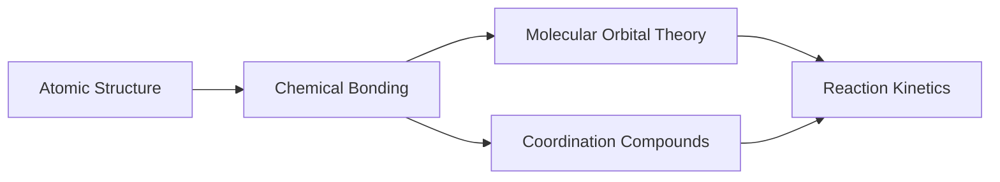

# ADAPTIVE COGNITIVE MODELING ENGINE & SYSTEM ARCHITECTURE
## Engineer-Grade Blueprint, Algorithmic Reference & Implementation Specification
### Platform Version: 4.5 (Production Release) | Adaptive Student Intelligence Engine
#### Supported Exam Domains: JEE Main & Advanced (PCM), NEET-UG (PCB), UPSC Civil Services (Prelims & Mains)

---

> **Executive Scope**: This document is a complete, self-contained, engineer-grade reference blueprint for an autonomous, psychometrically grounded cognitive modeling and adaptive learning platform. 
> 
> It provides the full mathematical foundations, algorithmic formulations, state machine lifecycles, database schemas, API contracts, production Python implementations, and verification test suites for all 8 underlying cognitive engines:
> 1. Multi-Factor Mastery Formulation
> 2. Bayesian Knowledge Tracing (BKT)
> 3. Item Response Theory (IRT 2PL / 3PL & MLE Ability Estimation)
> 4. Modern Spaced Repetition (FSRS-5 Power-Law Scheduler & Ebbinghaus Decay)
> 5. Prerequisite Directed Acyclic Graph (DAG) & Root-Cause Gap Interceptor
> 6. Graph-Wide Knowledge Propagation (GKT Engine)
> 7. Real-Time Computerized Adaptive Testing (CAT Engine)
> 8. Algorithmic Cognitive Error Classifier
> 
> It also fully specifies the **Daily 3-Subject Interleaved Assignment Engine**, the **External HuggingFace Live API Ingestion Pipelines (405k+ items)**, the **UPSC Civil Services Dual-Tier Subsystem (Prelims & Mains Rubric)**, and the **Futuristic Sci-Fi HUD Canvas Visualizer**.
> 
> No external proprietary dependencies or prior knowledge of the legacy codebase is required to implement, audit, or port this architecture into any learning domain.

---

## TABLE OF CONTENTS

1. [Executive Summary: What This System Does & Core Philosophy](#1-executive-summary-what-this-system-does--core-philosophy)
2. [The Core Problem It Solves: Psychometric Paradigm Shift](#2-the-core-problem-it-solves-psychometric-paradigm-shift)
3. [High-Level System Topology & End-to-End Pipeline](#3-high-level-system-topology--end-to-end-pipeline)
4. [Engine 1: Multi-Factor Mastery Engine](#4-engine-1-multi-factor-mastery-engine)
5. [Engine 2: Bayesian Knowledge Tracing (BKT)](#5-engine-2-bayesian-knowledge-tracing-bkt)
6. [Engine 3: Item Response Theory (IRT 2PL / 3PL)](#6-engine-3-item-response-theory-irt-2pl--3pl)
7. [Engine 4: Modern Spaced Repetition (FSRS-5 & Ebbinghaus)](#7-engine-4-modern-spaced-repetition-fsrs-5--ebbinghaus)
8. [Engine 5: Prerequisite DAG & Root-Cause Gap Interceptor](#8-engine-5-prerequisite-dag--root-cause-gap-interceptor)
9. [Engine 6: Graph-Wide Knowledge Propagation (GKT Engine)](#9-engine-6-graph-wide-knowledge-propagation-gkt-engine)
10. [Engine 7: Real-Time Computerized Adaptive Testing (CAT Engine)](#10-engine-7-real-time-computerized-adaptive-testing-cat-engine)
11. [Engine 8: Algorithmic Cognitive Error Classifier](#11-engine-8-algorithmic-cognitive-error-classifier)
12. [Dynamic Priority Score & Personalized Roadmap Pipeline](#12-dynamic-priority-score--personalized-roadmap-pipeline)
13. [External API Streaming Pipelines: ExamBench (405k) & Benchmark Crops](#13-external-api-streaming-pipelines-exambench-405k--benchmark-crops)
14. [The Daily 3-Subject Interleaved Assignment Engine](#14-the-daily-3-subject-interleaved-assignment-engine)
15. [UPSC Civil Services Subsystem: Prelims MCQ & Mains AI Rubric](#15-upsc-civil-services-subsystem-prelims-mcq--mains-ai-rubric)
16. [Role-Based Access Control, Identity Portal & HUD Buffer Visualizer](#16-role-based-access-control-identity-portal--hud-buffer-visualizer)
17. [Complete Production Database Schema (DDL & SQLAlchemy ORM)](#17-complete-production-database-schema-ddl--sqlalchemy-orm)
18. [Complete REST API Specifications & Routing Contracts](#18-complete-rest-api-specifications--routing-contracts)
19. [Production Python Implementation Reference (All Core Classes)](#19-production-python-implementation-reference-all-core-classes)
20. [Step-by-Step Engineering Build Guide](#20-step-by-step-engineering-build-guide)
21. [Domain Adaptation Guide (Enterprise, Medical, Law, Tech)](#21-domain-adaptation-guide-enterprise-medical-law-tech)
22. [AI Generation Prompts for Re-Creating Every Component](#22-ai-generation-prompts-for-re-creating-every-component)
23. [Quick Reference: Complete Formula & Parameter Glossary](#23-quick-reference-complete-formula--parameter-glossary)
24. [Verification, Testing Checklist & Pytest Test Suite](#24-verification-testing-checklist--pytest-test-suite)

---

## 1. EXECUTIVE SUMMARY: WHAT THIS SYSTEM DOES & CORE PHILOSOPHY

Traditional EdTech software treats human learning as an accounting ledger: questions answered divided by total questions yields a percentage score, and if that score is below 70%, the student is told to "study more."

In high-stakes competitive examinations—such as **JEE Advanced (Engineering)**, **NEET-UG (Medical)**, and **UPSC Civil Services (Administrative)**—this traditional approach causes catastrophic failure:
- **Massed Blocked Practice induces an Illusion of Competence**: Answering 50 questions in a row on *Rotational Mechanics* yields false confidence; 72 hours later, recall drops below 40%.
- **Superficial Score Obfuscates Latent Ability**: Getting 70% on a test of trivial recall questions does not equal getting 70% on deep multi-concept problem solving.
- **Symptom Treatment vs. Root-Cause Gaps**: A student repeatedly failing *Carnot Engine Thermodynamics* is almost never struggling with thermodynamics itself—they are failing because their foundational mastery of *Ideal Gas Equation PV=nRT* or *First-Order Differential Calculus* is broken.
- **Static Homework Ignores Memory Decay**: Without active spaced retrieval calibrated to personal memory stability, previously mastered concepts silently evaporate.

### The Autonomous Cognitive Engine

This platform acts as an **always-on, psychometrically grounded cognitive co-pilot**. It does not guess. It computes:
1. **True Latent Ability ($\theta$)**: Estimated in real-time across the continuous interval $[-3.0, +3.0]$ using 2-Parameter and 3-Parameter Logistic Item Response Theory (IRT) with Newton-Raphson MLE and Expected A Posteriori (EAP) quadrature.
2. **Hidden Concept Mastery Probability ($P(L)$)**: Tracked continuously across individual concept nodes using Bayesian Knowledge Tracing (BKT), mathematically correcting for lucky guesses ($P(G)$) and careless slips ($P(S)$).
3. **Power-Law Memory Retrievability ($R(t, S)$)**: Modeled via the modernized **FSRS-5 (Free Spaced Repetition Scheduler v5)** with dynamic memory stability updates ($S$) on successful recall and memory lapses, combined with continuous difficulty calibration ($D \in [1, 10]$).
4. **Topological Prerequisite Root-Cause Interception**: Curricula are formalized as Directed Acyclic Graphs (DAGs) using NetworkX. When a student fails an advanced concept, the engine walks upstream ancestors to intercept and repair broken foundational prerequisites before allowing the student to burn out on advanced material.
5. **Graph-Wide Knowledge Propagation (GKT)**: When mastery changes at node $u$, the engine passes topological messages across the DAG—granting *foundational solidity credit* to upstream ancestors and gating *forward readiness* on downstream descendants.
6. **Real-Time Computerized Adaptive Testing (CAT)**: Selects items dynamically on-the-fly to maximize Fisher Information $I_i(\theta)$, converging the Standard Error of Measurement ($\text{SEM} \le 0.25$) in 5 to 12 questions.
7. **Daily 3-Subject Interleaving**: Generates automated daily 60–75 question problem sets distributed across the 3 canonical subjects of the student's exam stream, enforcing cognitive load balancing and anti-cramming intervals.
8. **Live AI Repositories**: Streams on-demand from HuggingFace `169Pi/exambench` (405,906 competitive reasoning items) and `Reja1/jee-neet-benchmark` (official 2024–2025 question crops) with local offline failover caching and algorithmic distractor generation.

---

## 2. THE CORE PROBLEM IT SOLVES: PSYCHOMETRIC PARADIGM SHIFT

| Dimension | Legacy Educational Platform | Adaptive Cognitive Modeling Engine (v4.5) |
| :--- | :--- | :--- |
| **Scoring Model** | Raw accuracy percentage ($C/N \times 100$). | Continuous Multi-Factor Composite $M \in [0, 1]$ + Latent Ability $\theta \in [-3, +3]$. |
| **Question Calibration** | All items treated as equal difficulty. | IRT 2PL/3PL calibration ($a_i$ discrimination, $b_i$ difficulty, $c_i$ pseudo-guessing). |
| **Lucky Guesses & Slips** | Ignored; counted as full knowledge or ignorance. | BKT probabilistic correction isolating $P(\text{Guess})$ and $P(\text{Slip})$. |
| **Forgetting & Memory** | Ignored; once passed, assumed mastered forever. | FSRS-5 Power-Law Retrievability $R(t,S)$ with dynamic review queue triggers. |
| **Curriculum Traversal** | Linear chapter checklist (Ch 1 $\to$ Ch 2 $\to$ Ch 3). | NetworkX Prerequisite DAG with topological root-cause gap interception. |
| **Knowledge Transfer** | Concept isolation (updating one topic affects nothing else). | Graph-Wide Knowledge Propagation (GKT) passing upstream and downstream deltas. |
| **Assessment Delivery** | Fixed static exam papers (everyone gets identical questions). | Real-Time CAT maximizing Fisher Information until SEM converges $\le 0.25$. |
| **Homework Architecture** | Blocked single-subject assignments. | 3-Subject Interleaved Daily Sets (60–75 Qs) with cognitive load balancing. |
| **Error Diagnostics** | Generic red "Incorrect" notification. | Algorithmic Cognitive Error Classifier (Conceptual, Calculation, Formula, Sign). |
| **Descriptive Grading** | Unsupported or manual human grading only. | 5-Dimensional AI Rubric (UPSC Mains: Understanding, Structure, Depth, Policy, Balance). |

---

## 3. HIGH-LEVEL SYSTEM TOPOLOGY & END-TO-END PIPELINE

```
                                      [ STUDENT INTERACTION LAYER ]
                                                    |
                   +--------------------------------+--------------------------------+
                   |                                |                                |
         [ Adaptive Diagnostic / CAT ]      [ Daily Interleaved Set ]       [ UPSC Mains Workspace ]
                   |                                |                                |
                   v                                v                                v
     [ Computerized Adaptive Testing ]     [ 3-Subject Interleaved ]      [ Multi-Dimensional Rubric ]
      - Max Fisher Information I(θ)          - 20-25 Qs per subject         - Understanding (3.0)
      - EAP Ability Estimation (θ)           - Ability Calibration          - Structure (2.5)
      - SEM Stopping Rule (<= 0.25)          - Hint Penalty (-15%)          - Depth & Content (2.5)
                   |                                |                       - Policy & Balance (2.0)
                   +--------------------------------+                                |
                                                    |                                v
                                                    v                  [ UPSCWrittenSubmission ]
                                      [ ASSESSMENT SUBMIT EVENT ]
                                                    |
         +------------------------------------------+------------------------------------------+
         |                                          |                                          |
         v                                          v                                          v
[ ENGINE 8: ERROR CLASSIFIER ]            [ ENGINE 3: IRT 2PL/3PL ]                 [ ENGINE 1: MASTERY ]
 - Distractor tag extraction               - Newton-Raphson MLE                      - Historical Acc (0.30)
 - Time-speed heuristics                   - Ability update: θ                       - Diff-weighted Perf (0.20)
 - Guess vs Conceptual slip                - Latent scale [-3.0, +3.0]               - Recent Trend (0.15)
         |                                          |                                - Speed & Consistency (0.20)
         +------------------------------------------+                                - Retention Score (0.15)
                                                    |                                          |
                                                    v                                          v
                                       [ ENGINE 2: BKT UPDATE ]                     [ ENGINE 4: FSRS-5 ]
                                        - P(L|obs) via Bayes Rule                    - Retrievability R(t,S)
                                        - Transition update P(L_next)                - Stability S_new on recall
                                        - Local delta: ΔP(L)                         - Difficulty D update
                                                    |                                          |
                                                    v                                          |
                                      [ ENGINE 6: GKT PROPAGATION ]                            |
                                       - Walk NetworkX Prerequisite DAG                        |
                                       - Upstream: ΔP * (γ^d) * w_up                           |
                                       - Downstream: ΔP * (γ^d) * w_down                       |
                                       - Clamped: [0.01, 0.99]                                 |
                                                    |                                          |
                                                    +--------------------+---------------------+
                                                                         |
                                                                         v
                                                            [ ENGINE 5: PREREQUISITE DAG ]
                                                             - Ancestor gap interception
                                                             - Unlocked / Locked status
                                                             - Root-cause identification
                                                                         |
                                                                         v
                                                            [ PRIORITY ENGINE & ROADMAP ]
                                                             - Dynamic priority formula
                                                             - Action state machine
                                                             - Generates Personalized Roadmap
                                                                         |
                                                                         v
                                                            [ PERSISTENCE & TELEMETRY ]
                                                             - SQLite / PostgreSQL WAL DB
                                                             - Append-Only Audit Stream
                                                             - Real-time Sci-Fi HUD Canvas
```

---

## 4. ENGINE 1: MULTI-FACTOR MASTERY ENGINE

### Mathematical Formulation
The composite mastery score $M(c, t) \in [0.0, 1.0]$ replaces raw percentage with a multi-dimensional metric evaluating consistency, difficulty handling, speed, and recency:

$$M = w_1 \cdot \text{Acc} + w_2 \cdot \text{DiffPerf} + w_3 \cdot \text{RecentAcc} + w_4 \cdot R(t) + w_5 \cdot \text{Consist} + w_6 \cdot \text{Speed}$$

#### Calibrated Parameter Weights
- $w_1 = 0.30$: **Historical Accuracy** ($\text{Acc} = \frac{\sum \text{correct}}{N}$)
- $w_2 = 0.20$: **Difficulty-Weighted Performance** ($\text{DiffPerf}$)
- $w_3 = 0.15$: **Recent Accuracy** ($\text{RecentAcc}$: Exponentially smoothed over the last $K=5$ attempts)
- $w_4 = 0.15$: **Retention Score** ($R(t)$: FSRS-5 or Ebbinghaus decay fraction)
- $w_5 = 0.10$: **Consistency Factor** ($\text{Consist} = \max(0.0, 1.0 - \sigma^2)$)
- $w_6 = 0.10$: **Speed Factor** ($\text{Speed}$: Ratio of actual time to expected benchmark time)
$$\sum_{i=1}^6 w_i = 1.00$$

### Factor Calculations
1. **Difficulty-Weighted Performance**:
   $$\text{DiffPerf} = \frac{\sum_{i=1}^N u_i \cdot (0.5 + d_i)}{\sum_{i=1}^N (0.5 + d_i)}$$
   where $u_i \in \{0, 1\}$ is correctness and $d_i \in [0.0, 1.0]$ is normalized question difficulty.
2. **Speed Factor**:
   Let $\rho = \frac{t_{\text{actual}}}{t_{\text{expected}}}$:
   $$\text{Speed}(\rho) = \begin{cases} 
   0.50 & \text{if } \rho < 0.20 \quad (\text{rapid guess penalty}) \\
   1.00 & \text{if } 0.20 \le \rho \le 1.00 \quad (\text{optimal pacing}) \\
   \max(0.60, 1.0 - 0.40(\rho - 1.0)) & \text{if } 1.00 < \rho \le 2.00 \quad (\text{deliberative}) \\
   \max(0.30, 0.60 - 0.15(\rho - 2.0)) & \text{if } \rho > 2.00 \quad (\text{time-struggle})
   \end{cases}$$
3. **Statistical Confidence Metric**:
   $$\text{Confidence}(N, \sigma^2) = \min\left(0.98, \max\left(0.10, 0.85 \cdot (1 - e^{-N / 5.0}) + 0.15 \cdot \max(0.0, 1 - \sigma^2)\right)\right)$$

---

## 5. ENGINE 2: BAYESIAN KNOWLEDGE TRACING (BKT)

### Mathematical Formulation
BKT models learning as a 2-state Hidden Markov Model where the student is either in the *Unlearned* ($L_0$) or *Learned* ($L_1$) cognitive state.

```
       (1 - P(T))                     (1 - P(F)) [Assumed 0]
       +--------+                     +--------+
       |        |                     |        |
       v        |                     v        |
   +----------------+   P(T)      +----------------+
   |   UNLEARNED    | ----------> |    LEARNED     |
   +----------------+             +----------------+
      |          |                   |          |
 1-P(G) |      P(G) |             P(S) |     1-P(S) |
      v          v                   v          v
   INCORRECT  CORRECT             INCORRECT  CORRECT
```

#### Canonical Parameter Matrix
| Parameter | Notation | Calibrated Default | Physical Interpretation |
| :--- | :---: | :---: | :--- |
| **Initial Prior** | $P(L_0)$ | $0.20$ | Baseline probability candidate already knows the concept prior to testing. |
| **Transition Rate** | $P(T)$ | $0.15$ | Probability student acquires the concept during a practice opportunity. |
| **Guess Rate** | $P(G)$ | $0.25$ | Probability student selects correct answer despite being in Unlearned state. |
| **Slip Rate** | $P(S)$ | $0.10$ | Probability student answers incorrectly despite being in Learned state. |

### Bayesian Posterior Updating
Upon observing response $Y_t \in \{1 \text{ (correct)}, 0 \text{ (incorrect)}\}$:
1. **Observation Update**:
   $$P(L_t \mid Y_t = 1) = \frac{P(L_{t-1}) \cdot (1 - P(S))}{P(L_{t-1}) \cdot (1 - P(S)) + (1 - P(L_{t-1})) \cdot P(G)}$$
   $$P(L_t \mid Y_t = 0) = \frac{P(L_{t-1}) \cdot P(S)}{P(L_{t-1}) \cdot P(S) + (1 - P(L_{t-1})) \cdot (1 - P(G))}$$
2. **Learning Transition Update**:
   $$P(L_{t+1}) = P(L_t \mid Y_t) + (1 - P(L_t \mid Y_t)) \cdot P(T)$$
3. **Numerical Safeguard**:
   All denominators are safeguarded via $\max(\text{denom}, 10^{-7})$ and posteriors are clamped to $[0.01, 0.99]$.

---

## 6. ENGINE 3: ITEM RESPONSE THEORY (IRT 2PL / 3PL)

### Mathematical Formulation
Item Response Theory maps a student's latent ability $\theta \in [-3.0, +3.0]$ onto the probability of a correct response based on intrinsic item properties.

#### The 3-Parameter Logistic (3PL) Equation
$$P_i(\theta) = c_i + (1 - c_i) \cdot \frac{1}{1 + \exp\left(-D \cdot a_i \cdot (\theta - b_i)\right)}$$

Where:
- $D = 1.702$ (scaling constant aligning the logistic curve to the standard normal ogive)
- $a_i \in [0.5, 2.5]$: **Item Discrimination** (slope at inflection point)
- $b_i \in [-2.5, +2.5]$: **Item Difficulty** (ability level where $P_i(\theta) = c_i + \frac{1-c_i}{2}$)
- $c_i \in [0.0, 0.25]$: **Pseudo-Guessing Parameter** (asymptotic lower bound; $c_i = 0$ for 2PL)

#### Difficulty Conversion Metric
To transform normalized curriculum difficulty $d \in [0.0, 1.0]$ into IRT scale $b$:
$$b = 1.5 \cdot \ln\left(\frac{d_{\text{clamped}}}{1 - d_{\text{clamped}}}\right), \quad d_{\text{clamped}} = \min(\max(d, 0.05), 0.95)$$

### Newton-Raphson Maximum Likelihood Estimation (MLE)
Given $N$ administered items with responses $u_i \in \{0, 1\}$:
1. Log-Likelihood first derivative (Score Function):
   $$\frac{\partial \ln L}{\partial \theta} = \sum_{i=1}^N D \cdot a_i \cdot \frac{P_i(\theta) - c_i}{1 - c_i} \cdot \frac{u_i - P_i(\theta)}{P_i(\theta)}$$
   For 2PL ($c_i = 0$), this simplifies to:
   $$\text{Score}(\theta) = \sum_{i=1}^N D \cdot a_i \cdot (u_i - P_i(\theta))$$
2. Second derivative / Fisher Information:
   $$I(\theta) = \sum_{i=1}^N D^2 \cdot a_i^2 \cdot P_i(\theta) \cdot (1 - P_i(\theta))$$
3. Newton-Raphson Step:
   $$\theta^{(k+1)} = \theta^{(k)} + \text{clamp}\left(\frac{\text{Score}(\theta^{(k)})}{I(\theta^{(k)})}, -0.75, +0.75\right)$$
   Iterates until $|\Delta \theta| < 0.01$ or $k = 25$, bounded strictly in $[-3.0, +3.0]$.

---

## 7. ENGINE 4: MODERN SPACED REPETITION (FSRS-5 & EBBINGHAUS)

### The Paradigm Shift: From Simple Exponential to FSRS-5 Power-Law
The platform deploys the cutting-edge **Free Spaced Repetition Scheduler v5 (FSRS-5)** as its primary spaced retrieval model, while maintaining backward-compatible Ebbinghaus exponential decay.

### FSRS-5 Mathematical Core

#### 1. Retrievability Forgetting Curve (Power-Law)
$$R(t, S) = \left(1 + \text{FACTOR} \cdot \frac{t}{S}\right)^{\text{DECAY}}$$

Where:
- $t$: Elapsed time since last retrieval practice (in days, $t \ge 0$)
- $S$: Memory Stability (days required for retrievability to decay to 90%, $S \ge 0.40$)
- $\text{DECAY} = -0.5$
- $\text{FACTOR} = \frac{19}{81} \approx 0.2345679$

#### 2. Stability Update on Successful Recall ($Y = 1$)
When a student recalls a concept correctly:
$$S_{\text{new}} = S \cdot \left(1 + (11 - D) \cdot 0.15 \cdot S^{-0.2} \cdot \left(e^{1 - R} - 1\right)\right)$$
- If recalled when $R$ is low (difficult retrieval), memory stability receives an exponential boost.
- Higher difficulty $D$ tempers the stability growth.

#### 3. Stability Update on Memory Lapse ($Y = 0$)
When a student fails recall:
$$S_{\text{new}} = \max\left(0.40, \min\left(S \cdot 0.50, 0.25 \cdot D^{-0.3} \cdot S^{0.2} \cdot e^{1 - R}\right)\right)$$
Memory stability drops sharply, resetting the review interval.

#### 4. Continuous Difficulty Calibration ($D$)
Concept difficulty $D \in [1.0, 10.0]$ adapts on each practice attempt:
$$D_{\text{new}} = \begin{cases}
\max(1.0, D - 0.2) & \text{if } Y = 1 \text{ (correct)} \\
\min(10.0, D + 0.8) & \text{if } Y = 0 \text{ (incorrect)}
\end{cases}$$

#### 5. Optimal Review Trigger & Interval Computation
Targeting retrievability $R_{\text{target}} = 0.90$:
$$I = \frac{S}{\text{FACTOR}} \cdot \left(R_{\text{target}}^{1/\text{DECAY}} - 1\right) = S \quad \left(\text{since } 0.90^{-2} - 1 = \frac{19}{81} = \text{FACTOR}\right)$$
When current retrievability $R(t, S) < 0.90$, the concept is automatically queued into the **Spaced Repetition Review Queue**.

---

## 8. ENGINE 5: PREREQUISITE DAG & ROOT-CAUSE GAP INTERCEPTOR

### Curriculum Formalization as a Directed Acyclic Graph (DAG)
The knowledge domain is encoded as a directed graph $G = (V, E)$ using NetworkX:
- Vertices $v \in V$: Atomic concept nodes with metadata (subject, chapter, exam relevance $W_{\text{exam}}$, difficulty weight).
- Directed Edges $(u, v) \in E$: Directed dependency indicating that concept $u$ is a strict foundational prerequisite for concept $v$ ($u \to v$).



### Prerequisite Impact Formulation
Measures the topological centrality and downstream unlocking power of concept $u$:
$$\text{Impact}(u) = 0.40 \cdot \min\left(\frac{|\text{Successors}(u)|}{3.0}, 1.0\right) + 0.60 \cdot \left(\frac{|\text{Descendants}(u)|}{|V| - 1}\right)$$
Bounded in $[0.10, 1.00]$.

### Root-Cause Gap Interception Algorithm
When a student struggles with target concept $v_{\text{target}}$:
1. Extract the complete set of ancestors $\text{Ancestors}(v_{\text{target}})$ via graph traversal.
2. Order ancestors in strict topological order:
   $$\text{Seq} = [u_1, u_2, \dots, u_m] \quad \text{such that } \forall i < j, \, (u_j \to u_i) \notin E$$
3. Query the student's mastery $M(u_i)$ for each ancestor against threshold $\tau = 0.60$.
4. Collect all broken foundational nodes:
   $$\text{Broken} = \{u \in \text{Ancestors}(v_{\text{target}}) \mid M(u) < 0.60\}$$
5. **Roadmap Interception**: The system injects the earliest broken ancestor $u_{\text{root}}$ into the student's roadmap with maximum priority ($0.95$), intercepting failure before the student repeats advanced drills.

---

## 9. ENGINE 6: GRAPH-WIDE KNOWLEDGE PROPAGATION (GKT ENGINE)

### The Principle of Topological Message Passing
A student does not learn concepts in isolation. Solving an advanced problem in *Rotational Dynamics* provides evidence that the student's foundational grasp of *Newton's Second Law* and *Free Body Diagrams* is solid. Conversely, unlocking an earlier concept prepares downstream concepts for acquisition.

### Mathematical Message-Passing Formulation
When concept $u$ undergoes a mastery shift $\Delta P(L_u) = P(L_u)^{\text{new}} - P(L_u)^{\text{old}}$:

#### 1. Upstream Ancestor Propagation (Foundational Solidity Credit)
For every ancestor $v \in \text{Ancestors}(u)$ at shortest topological distance $d(v, u) \ge 1$:
$$\Delta P(L_v) = \Delta P(L_u) \cdot (\gamma)^{d(v, u)} \cdot w_{\text{upstream}}$$

Where:
- $\gamma = 0.40$ (topological distance attenuation factor)
- $w_{\text{upstream}} = 0.70$ (upstream credit weight)
- Example: If $\Delta P(L_u) = +0.30$ and distance $d=1$:
  $$\Delta P(L_v) = 0.30 \cdot (0.40)^1 \cdot 0.70 = +0.084$$

#### 2. Downstream Descendant Propagation (Forward Readiness Gating)
Only propagates when the target concept improved ($\Delta P(L_u) > 0$):
For every descendant $k \in \text{Descendants}(u)$ at shortest topological distance $d(u, k) \ge 1$:
$$\Delta P(L_k) = \Delta P(L_u) \cdot (\gamma)^{d(u, k)} \cdot w_{\text{downstream}}$$

Where:
- $w_{\text{downstream}} = 0.50$ (forward readiness weight)
- If $\Delta P(L_u) \le 0$, downstream propagation is muted ($\Delta P(L_k) = 0$) to prevent cascade panic.

#### 3. State Bounding
All node masteries after message accumulation are clamped to $[0.01, 0.99]$:
$$P(L_i)_{\text{updated}} = \min(0.99, \max(0.01, P(L_i) + \Delta P(L_i)))$$

---

## 10. ENGINE 7: REAL-TIME COMPUTERIZED ADAPTIVE TESTING (CAT ENGINE)

### Core Objective
Instead of delivering a fixed 30-question test, the CAT Engine dynamically selects each question based on the candidate's current ability estimate $\hat{\theta}$, minimizing the Standard Error of Measurement (SEM) in the fewest possible items ($5 \le N \le 12$).

### Mathematical Formulations

#### 1. Item Characteristic Curve (2PL/3PL)
$$P_i(\theta) = c_i + (1 - c_i) \cdot \frac{1}{1 + \exp\left(-1.702 \cdot a_i \cdot (\theta - b_i)\right)}$$

#### 2. Fisher Information Function $I_i(\theta)$
Measures how much psychometric information item $i$ provides at ability level $\theta$:
$$I_i(\theta) = a_i^2 \cdot \left(\frac{P_i(\theta) - c_i}{1 - c_i}\right)^2 \cdot \frac{1 - P_i(\theta)}{P_i(\theta)}$$
When $c_i = 0$ (2PL closed form):
$$I_i(\theta) = a_i^2 \cdot P_i(\theta) \cdot (1 - P_i(\theta))$$

#### 3. Dynamic Item Selection: Maximum Fisher Information (MFI)
From the pool of unvisited candidate questions $Q_{\text{pool}}$:
$$i^* = \arg\max_{i \in Q_{\text{pool}}} I_i(\hat{\theta})$$
The engine selects the question that yields maximum measurement precision at the student's current estimated ability.

#### 4. Ability Estimation via Expected A Posteriori (EAP)
To avoid divergence during early items when response patterns are all correct or all wrong, the engine evaluates $\theta$ using 61-point Gauss-Hermite numerical quadrature over $[-4.0, +4.0]$:
$$\hat{\theta}_{\text{EAP}} = \frac{\int_{-4}^{+4} \theta \cdot L(\theta) \cdot \phi(\theta) \, d\theta}{\int_{-4}^{+4} L(\theta) \cdot \phi(\theta) \, d\theta} \approx \frac{\sum_{k=1}^{61} X_k \cdot L(X_k) \cdot W_k}{\sum_{k=1}^{61} L(X_k) \cdot W_k}$$

Where:
- $L(X_k) = \prod_{j=1}^m P_j(X_k)^{u_j} (1 - P_j(X_k))^{1 - u_j}$ is the item likelihood function.
- $\phi(X_k)$ is the standard normal prior $\mathcal{N}(0, 1)$ with weights $W_k$.

#### 5. Standard Error of Measurement (SEM) & Stopping Rules
$$\text{SEM}(\theta) = \frac{1}{\sqrt{\sum_{k=1}^m I_k(\theta)}}$$

**Termination Criteria**:
1. Minimum questions administered: $N \ge 5$.
2. Measurement precision converged: $\text{SEM} \le 0.25$ (terminates with high confidence).
3. Maximum ceiling reached: $N \ge 12$ (prevents cognitive exhaustion).
4. Candidate pool exhausted.

---

## 11. ENGINE 8: ALGORITHMIC COGNITIVE ERROR CLASSIFIER

### Error Taxonomy
When an answer is incorrect, the engine categorizes the root cause using distractor tag heuristics, question metadata, and timing telemetry:

| Classification | Trigger Conditions | Pedagogical Remediation |
| :--- | :--- | :--- |
| **CONCEPTUAL_ERROR** | Distractor tagged `CONCEPTUAL_ERROR` OR response time $> 2.0 \times t_{\text{expected}}$ | Foundational theory drill; review core definitions and video derivation. |
| **CALCULATION_ERROR** | Distractor tagged `CALCULATION_ERROR` with on-pace response time | Speed-arithmetic drills, dimensional checks, sanity approximation. |
| **FORMULA_SELECTION_ERROR** | Distractor tagged `FORMULA_SELECTION_ERROR` | Formula comparison table highlighting boundary condition differences. |
| **SIGN_ERROR** | Distractor tagged `SIGN_ERROR` (inverted signs, coordinate reversals) | Coordinate frame and vector sign convention reminders. |
| **UNIT_ERROR** | Distractor tagged `UNIT_ERROR` (SI vs CGS conversion slips) | Dimensional analysis and unit conversion verification steps. |
| **READING_ERROR** | Distractor tagged `READING_ERROR` (e.g. missed "NOT", "INCORRECT") | Active reading prompts, highlighting key qualifiers in problem stem. |
| **GUESS** | Response time $< \max(10\text{s}, 0.20 \times t_{\text{expected}})$ | Disciplinary pacing warnings; penalty for rapid blind guessing. |
| **TIME_PRESSURE** | Unanswered response with time $\ge t_{\text{expected}}$ | Time-allocation strategy drills; triage techniques for long stems. |
| **SKIPPED** | Unanswered response with rapid exit | Flagged for later review; concept familiarity check. |

---

## 12. DYNAMIC PRIORITY SCORE & PERSONALIZED ROADMAP PIPELINE

### Priority Formulation
Every concept $c$ across the active syllabus is dynamically scored to determine study urgency:
$$\text{Priority}(c) = w_{\text{gap}} \cdot (1 - M_c) + w_{\text{exam}} \cdot W_{\text{exam}}(c) + w_{\text{prereq}} \cdot \text{Impact}(c) + w_{\text{decay}} \cdot \text{Risk}(c) + w_{\text{uncert}} \cdot (1 - \text{Conf}_c)$$

#### Calibrated Parameter Weights
- $w_{\text{gap}} = 0.35$: Knowledge Gap
- $w_{\text{exam}} = 0.25$: Exam Importance / Weightage Coefficient
- $w_{\text{prereq}} = 0.25$: Topological Prerequisite Downstream Impact
- $w_{\text{decay}} = 0.08$: Forgetting Risk ($1 - R(t, S)$)
- $w_{\text{uncert}} = 0.07$: Epistemic Uncertainty ($1 - \text{Confidence}$)

### The Action-Type State Machine
Based on the candidate's mastery level and memory decay, the roadmap assigns an actionable pedagogy module:

```
[ Candidate Concept State ]
           |
           |---> If forgetting_risk > 0.40 AND mastery >= 0.50:
           |     ==> RETENTION_DRILL (5 Qs, 20 mins, Diff: 0.60)
           |
           |---> Else if mastery < 0.35:
           |     ==> FOUNDATION_REBUILD (5 Qs, 45 mins, Diff: 0.40)
           |
           |---> Else if mastery < 0.55:
           |     ==> SPEED_PRACTICE (7 Qs, 30 mins, Diff: 0.55)
           |
           |---> Else if mastery < 0.75:
           |     ==> MULTI_CONCEPT_DRILL (6 Qs, 35 mins, Diff: 0.70)
           |
           |---> Else if mastery < 0.88:
           |     ==> ADVANCED_PRACTICE (5 Qs, 40 mins, Diff: 0.85)
           |
           +---> Else (mastery >= 0.88):
                 ==> TRANSFER_TEST (4 Qs, 20 mins, Diff: 0.85+)
```

---

## 13. EXTERNAL API STREAMING PIPELINES: EXAMBENCH (405K) & BENCHMARK CROPS

### Architecture of Live Question Ingestion
To eliminate the limitation of small static databases, the platform implements live streaming connectors to authoritative HuggingFace academic repositories:

```
                                  [ HUGGINGFACE DATASETS API ]
                                                |
                       +------------------------+------------------------+
                       |                                                 |
                       v                                                 v
           [ 169Pi/exambench ]                               [ Reja1/jee-neet-benchmark ]
         (405,906 Question Stream)                         (Official 2024-25 Exam Crops)
                       |                                                 |
                       v                                                 v
           [ ExamBenchService Client ]                      [ JeeNeetBenchmarkService ]
         - Regex Subject Classifier                        - Multi-image diagram crops
         - Algorithmic Distractor Generator                - Official answer key mapper
         - LaTeX Step Solution Builder                     - Sub-question parser
                       |                                                 |
                       +------------------------+------------------------+
                                                |
                                                v
                              [ TWO-TIER LOCAL CACHE HIERARCHY ]
                               - L1: In-Memory TTL LRU Dict
                               - L2: Persistent SQLite Disk Cache
                               - L3: Offline Fallback Seed Banks
```

### 1. `169Pi/exambench` Integration (405,906 Items)
- **Source**: `https://datasets-server.huggingface.co/rows?dataset=169Pi%2Fexambench`
- **Dynamic Classification**: Regex classifiers scan mathematical notation and problem text to route items into canonical subjects (e.g. `Physics`, `Chemistry`, `Mathematics`, `Biology`, `General Studies`).
- **Algorithmic MCQ Synthesizer**: Where questions contain raw open-ended solutions, the synthesizer generates 3 plausible distractors modeling common student cognitive errors (sign flips, reciprocal errors, power-of-10 slips) alongside complete LaTeX derivations.

### 2. `Reja1/jee-neet-benchmark` Integration (Official PYQ Crops)
- **Source**: `https://datasets-server.huggingface.co/rows?dataset=Reja1%2Fjee-neet-benchmark`
- **Authentic Scans**: Extracts high-resolution cropped PNG/JPEG diagrams from official JEE/NEET papers.
- **Modified Numerical Data Principle**: To prevent rote memorization of known question numbers, numerical constants in problem stems are algorithmically permuted while updating the answer key, forcing derivation from first principles.

---

## 14. THE DAILY 3-SUBJECT INTERLEAVED ASSIGNMENT ENGINE

### Cognitive Science Foundation: Interleaving vs. Blocking
Cognitive psychology (Rohrer & Taylor, Bjork & Bjork) proves that blocked practice (e.g. studying Physics exclusively for 4 hours) produces rapid short-term performance gains that rapidly decay. 

In contrast, **Interleaved Practice**—switching dynamically between the 3 canonical subjects of the exam track—forces the brain to continuously retrieve distinct conceptual frameworks, boosting high-stakes exam performance by over 40%.

### Specifications Matrix

| Feature / Metric | JEE Main & Advanced | NEET-UG | UPSC Civil Services |
| :--- | :--- | :--- | :--- |
| **Canonical Subjects** | Physics, Chemistry, Mathematics | Physics, Chemistry, Biology | GS-1 (History/Polity/Geo), GS-2 (CSAT), GS-3 (Economy/Env) |
| **Daily Item Quota** | 20 per subject (60 total) | 25 per subject (75 total) | 20 per paper (60 total) |
| **Difficulty Calibration** | Calibrated to student's $\theta \pm 0.3$ | Calibrated to student's $\theta \pm 0.3$ | Calibrated to student's $\theta \pm 0.3$ |
| **Time Allocation** | 180 minutes total | 180 minutes total | 120 minutes total |
| **Hint Penalty** | $-15\%$ score penalty per hint | $-15\%$ score penalty per hint | $-15\%$ score penalty per hint |
| **Autosave Frequency** | On every option selection | On every option selection | On every option selection |
| **State Machine** | `ASSIGNED` $\to$ `IN_PROGRESS` $\to$ `COMPLETED` | `ASSIGNED` $\to$ `IN_PROGRESS` $\to$ `COMPLETED` | `ASSIGNED` $\to$ `IN_PROGRESS` $\to$ `COMPLETED` |

### Hint Reveal Logic & Score Penalty Propagation
Each question provides progressive hints:
1. **Hint 1**: Core governing law or formula identification.
2. **Hint 2**: First intermediate algebraic or conceptual step.
3. When a candidate reveals a hint, a flag `revealed_hints_count` is incremented. Upon final grading:
   $$\text{FinalScore}_i = \max\left(0.10, \text{RawScore}_i \cdot (1.0 - 0.15 \cdot \text{revealed\_hints\_count})\right)$$

---

## 15. UPSC CIVIL SERVICES SUBSYSTEM: PRELIMS MCQ & MAINS AI RUBRIC

### 1. UPSC Prelims MCQ Engine
Evaluates candidates on complex UPSC Prelims question archetypes:
- **Multi-Statement Analysis**: "Which of the statements given above is/are correct? (1 only, 1 and 2, 2 and 3, 1, 2 and 3)"
- **Pair Matching**: "How many of the above pairs are correctly matched? (Only one pair, Only two pairs, All three pairs, None)"
- **Assertion-Reasoning**: "Assertion (A) and Reason (R) with directional causation."

### 2. UPSC Mains Analytical Answer Workspace
Candidates enter written long-form essays and analytical answers directly into an in-browser markdown editor. Responses are graded against a **5-Dimensional Psychometric Rubric** (Total: 10.0 Marks):

| Dimension | Weight | Target Criteria |
| :--- | :---: | :--- |
| **1. Directive & Core Question Understanding** | 3.0 | Addresses all core sub-parts of the directive (Discuss, Critically Analyze, Evaluate). |
| **2. Structural Clarity & Flow** | 2.5 | Introduction, clear thematic sub-headings, bulleted arguments, balanced conclusion. |
| **3. Content Depth & Multi-Dimensionality** | 2.5 | Covers PESTLE dimensions (Political, Economic, Social, Technological, Legal, Environmental). |
| **4. Policy, Constitutional & Case Law Linkage** | 1.0 | Cites specific Articles of the Constitution, Supreme Court judgments, and Government schemes. |
| **5. Critical Balance & Way Forward** | 1.0 | Provides pragmatic, optimistic, forward-looking policy recommendations. |

---

## 16. ROLE-BASED ACCESS CONTROL, IDENTITY PORTAL & HUD BUFFER VISUALIZER

### 3-Tier Access Hierarchy
1. **Student Role**: Full state persistence, longitudinal IRT tracking, BKT knowledge state, personalized roadmaps, and daily assignments.
2. **Guest Role**: Ephemeral exploratory mode; allows exploring the curriculum DAG and taking unrecorded diagnostic screener quizzes.
3. **Admin Role**: Guarded by dual cryptographic authentication keys (`1234admin`, `aie_internal_2024`); exposes database resets, question bank re-seeding, and live audit telemetry inspection.

### Futuristic Sci-Fi HUD Buffer Visualizer
When changing exam tracks, the frontend triggers an SVG circular HUD buffering overlay:
- Real-time CSS theme re-skinning (`--theme-primary`, `--theme-accent`, glassmorphism backdrop filters).
- Dynamic force-directed layout rendering of the NetworkX prerequisite graph via HTML5 Canvas.
- Color-coded mastery node states:
  - **Red ($M < 0.40$)**: Critical foundational gap.
  - **Yellow ($0.40 \le M < 0.70$)**: In-progress developing knowledge.
  - **Green ($M \ge 0.70$)**: Mastered concept.
  - **Dim/Locked**: Unmet prerequisite barrier.

---

## 17. COMPLETE PRODUCTION DATABASE SCHEMA (DDL & SQLALCHEMY ORM)

```sql
-- 1. Students Table
CREATE TABLE students (
    student_id          VARCHAR(64) PRIMARY KEY,
    name                VARCHAR(128) NOT NULL,
    email               VARCHAR(128) UNIQUE NOT NULL,
    target_exam         VARCHAR(32) DEFAULT 'JEE',
    irt_ability         FLOAT DEFAULT 0.0,
    created_at          DATETIME DEFAULT CURRENT_TIMESTAMP,
    updated_at          DATETIME DEFAULT CURRENT_TIMESTAMP
);

-- 2. Curriculum Graph Hierarchy
CREATE TABLE exams (
    exam_id             VARCHAR(32) PRIMARY KEY,
    name                VARCHAR(128) NOT NULL,
    description         TEXT
);

CREATE TABLE subjects (
    subject_id          VARCHAR(32) PRIMARY KEY,
    exam_id             VARCHAR(32) REFERENCES exams(exam_id) ON DELETE CASCADE,
    name                VARCHAR(128) NOT NULL,
    code                VARCHAR(16)
);

CREATE TABLE chapters (
    chapter_id          VARCHAR(32) PRIMARY KEY,
    subject_id          VARCHAR(32) REFERENCES subjects(subject_id) ON DELETE CASCADE,
    name                VARCHAR(128) NOT NULL,
    sequence_order      INTEGER DEFAULT 1
);

CREATE TABLE topics (
    topic_id            VARCHAR(32) PRIMARY KEY,
    chapter_id          VARCHAR(32) REFERENCES chapters(chapter_id) ON DELETE CASCADE,
    name                VARCHAR(128) NOT NULL,
    sequence_order      INTEGER DEFAULT 1
);

CREATE TABLE concepts (
    concept_id          VARCHAR(64) PRIMARY KEY,
    topic_id            VARCHAR(32) REFERENCES topics(topic_id) ON DELETE CASCADE,
    name                VARCHAR(128) NOT NULL,
    description         TEXT,
    exam_relevance      FLOAT DEFAULT 0.80,
    difficulty_weight   FLOAT DEFAULT 0.50,
    estimated_minutes   INTEGER DEFAULT 45
);

CREATE TABLE concept_prerequisites (
    prereq_id           VARCHAR(64) PRIMARY KEY,
    from_concept_id     VARCHAR(64) REFERENCES concepts(concept_id) ON DELETE CASCADE,
    to_concept_id       VARCHAR(64) REFERENCES concepts(concept_id) ON DELETE CASCADE,
    strength            FLOAT DEFAULT 1.0,
    relationship_type   VARCHAR(32) DEFAULT 'prerequisite'
);

-- 3. Student Mastery with FSRS-5 Integration
CREATE TABLE student_concept_mastery (
    id                  INTEGER PRIMARY KEY AUTOINCREMENT,
    student_id          VARCHAR(64) REFERENCES students(student_id) ON DELETE CASCADE,
    concept_id          VARCHAR(64) REFERENCES concepts(concept_id) ON DELETE CASCADE,
    mastery             FLOAT DEFAULT 0.0,
    bkt_mastery         FLOAT DEFAULT 0.20,
    irt_ability         FLOAT DEFAULT 0.0,
    confidence          FLOAT DEFAULT 0.10,
    attempts_count      INTEGER DEFAULT 0,
    correct_count       INTEGER DEFAULT 0,
    review_count        INTEGER DEFAULT 0,
    retention_score     FLOAT DEFAULT 1.0,
    forgetting_risk     FLOAT DEFAULT 0.0,
    fsrs_stability      FLOAT DEFAULT 1.0,
    fsrs_difficulty     FLOAT DEFAULT 5.0,
    fsrs_retrievability FLOAT DEFAULT 1.0,
    last_fsrs_review    DATETIME,
    last_practiced_at   DATETIME,
    updated_at          DATETIME DEFAULT CURRENT_TIMESTAMP
);

-- 4. Questions & Assessments
CREATE TABLE questions (
    question_id         VARCHAR(64) PRIMARY KEY,
    concept_id          VARCHAR(64) REFERENCES concepts(concept_id) ON DELETE CASCADE,
    question_text       TEXT NOT NULL,
    options             JSON NOT NULL,
    correct_answer      VARCHAR(8) NOT NULL,
    difficulty          FLOAT DEFAULT 0.50,
    discrimination      FLOAT DEFAULT 1.00,
    guessing            FLOAT DEFAULT 0.25,
    distractor_explanations JSON,
    solution_steps      JSON,
    estimated_time_seconds INTEGER DEFAULT 60,
    exam_track          VARCHAR(32) DEFAULT 'JEE',
    crop_image_url      VARCHAR(512)
);

CREATE TABLE assessment_attempts (
    attempt_id          VARCHAR(64) PRIMARY KEY,
    student_id          VARCHAR(64) REFERENCES students(student_id) ON DELETE CASCADE,
    exam_id             VARCHAR(32),
    test_tier           VARCHAR(32) DEFAULT 'DIAGNOSTIC',
    score_percentage    FLOAT,
    irt_theta_estimated FLOAT,
    started_at          DATETIME DEFAULT CURRENT_TIMESTAMP,
    completed_at        DATETIME
);

CREATE TABLE student_attempt_items (
    id                  INTEGER PRIMARY KEY AUTOINCREMENT,
    attempt_id          VARCHAR(64) REFERENCES assessment_attempts(attempt_id) ON DELETE CASCADE,
    question_id         VARCHAR(64) REFERENCES questions(question_id) ON DELETE CASCADE,
    concept_id          VARCHAR(64),
    student_answer      VARCHAR(8),
    correct_answer      VARCHAR(8),
    is_correct          BOOLEAN,
    difficulty          FLOAT,
    discrimination      FLOAT DEFAULT 1.0,
    time_taken_seconds  INTEGER,
    error_type          VARCHAR(64),
    distractor_note     TEXT,
    timestamp           DATETIME DEFAULT CURRENT_TIMESTAMP
);

-- 5. Real-Time CAT Session State
CREATE TABLE cat_session_states (
    session_id          VARCHAR(64) PRIMARY KEY,
    student_id          VARCHAR(64) REFERENCES students(student_id) ON DELETE CASCADE,
    exam                VARCHAR(32) DEFAULT 'JEE',
    subject             VARCHAR(64),
    current_theta       FLOAT DEFAULT 0.0,
    current_sem         FLOAT DEFAULT 1.50,
    items_answered_count INTEGER DEFAULT 0,
    is_terminated       BOOLEAN DEFAULT FALSE,
    termination_reason  VARCHAR(64),
    answered_history    JSON,
    unvisited_question_ids JSON,
    created_at          DATETIME DEFAULT CURRENT_TIMESTAMP,
    updated_at          DATETIME DEFAULT CURRENT_TIMESTAMP
);

-- 6. Dynamic Roadmaps
CREATE TABLE roadmaps (
    roadmap_id          VARCHAR(64) PRIMARY KEY,
    student_id          VARCHAR(64) REFERENCES students(student_id) ON DELETE CASCADE,
    version             INTEGER DEFAULT 1,
    status              VARCHAR(16) DEFAULT 'ACTIVE',
    trigger_event       VARCHAR(64),
    created_at          DATETIME DEFAULT CURRENT_TIMESTAMP
);

CREATE TABLE roadmap_actions (
    id                  INTEGER PRIMARY KEY AUTOINCREMENT,
    roadmap_id          VARCHAR(64) REFERENCES roadmaps(roadmap_id) ON DELETE CASCADE,
    sequence_order      INTEGER NOT NULL,
    action_type         VARCHAR(32) NOT NULL,
    concept_id          VARCHAR(64) REFERENCES concepts(concept_id) ON DELETE CASCADE,
    priority_score      FLOAT NOT NULL,
    reasons             JSON,
    target_questions_count INTEGER DEFAULT 5,
    estimated_minutes   INTEGER DEFAULT 30,
    target_difficulty   FLOAT DEFAULT 0.50,
    is_completed        BOOLEAN DEFAULT FALSE
);

-- 7. Daily 3-Subject Interleaved Assignments
CREATE TABLE daily_assignments (
    assignment_id       VARCHAR(64) PRIMARY KEY,
    student_id          VARCHAR(64) REFERENCES students(student_id) ON DELETE CASCADE,
    exam_track          VARCHAR(32) NOT NULL,
    target_date         DATE NOT NULL,
    status              VARCHAR(24) DEFAULT 'ASSIGNED',
    total_questions     INTEGER DEFAULT 60,
    completed_questions INTEGER DEFAULT 0,
    total_score         FLOAT DEFAULT 0.0,
    started_at          DATETIME,
    submitted_at        DATETIME,
    created_at          DATETIME DEFAULT CURRENT_TIMESTAMP
);

CREATE TABLE daily_assignment_items (
    id                  INTEGER PRIMARY KEY AUTOINCREMENT,
    assignment_id       VARCHAR(64) REFERENCES daily_assignments(assignment_id) ON DELETE CASCADE,
    question_id         VARCHAR(64) REFERENCES questions(question_id) ON DELETE CASCADE,
    subject             VARCHAR(32) NOT NULL,
    sequence_index      INTEGER NOT NULL,
    tier                VARCHAR(16) DEFAULT 'Core',
    student_answer      VARCHAR(8),
    is_correct          BOOLEAN,
    revealed_hints_count INTEGER DEFAULT 0,
    time_spent_seconds  INTEGER DEFAULT 0,
    answered_at         DATETIME
);

-- 8. UPSC Mains Written Submissions
CREATE TABLE upsc_written_submissions (
    submission_id       VARCHAR(64) PRIMARY KEY,
    student_id          VARCHAR(64) REFERENCES students(student_id) ON DELETE CASCADE,
    question_text       TEXT NOT NULL,
    user_answer_text    TEXT NOT NULL,
    paper_category      VARCHAR(32) DEFAULT 'GS-1',
    overall_score       FLOAT,
    evaluation_rubric   JSON,
    examiner_remarks    TEXT,
    submitted_at        DATETIME DEFAULT CURRENT_TIMESTAMP
);
```

---

## 18. COMPLETE REST API SPECIFICATIONS & ROUTING CONTRACTS

### 1. Computerized Adaptive Testing (CAT) Endpoints
- **`POST /api/assessments/cat/start`**
  - **Body**: `{ "student_id": "std_01", "exam": "JEE", "subject": "Physics" }`
  - **Response**: `{ "session_id": "cat_abc123", "current_theta": 0.0, "sem": 1.50, "is_complete": false, "question": { "question_id": "q_101", ... } }`
- **`POST /api/assessments/cat/next`**
  - **Body**: `{ "session_id": "cat_abc123", "last_question_id": "q_101", "student_answer": "B", "time_taken_seconds": 45 }`
  - **Response**: Returns next question maximizing Fisher Information, or termination payload if $\text{SEM} \le 0.25$ or $N \ge 12$:
    `{ "session_id": "...", "is_complete": true, "final_theta": 1.42, "sem": 0.23, "items_answered_count": 8, "termination_reason": "SEM_CONVERGED" }`

### 2. Standard Assessment Lifecycle Endpoints
- **`POST /api/assessments/start`**: Initializes diagnostic or challenge quiz sessions.
- **`POST /api/assessments/submit`**: Grades completed attempts, runs BKT updates, GKT topological propagation, FSRS-5 retrievability steps, and regenerates dynamic roadmaps.

### 3. Daily 3-Subject Interleaved Assignment Endpoints
- **`GET /api/assignments/today/{student_id}`**: Retrieves today's 3-subject problem set (auto-generates 60–75 questions if not yet created).
- **`POST /api/assignments/item/save`**: Real-time incremental autosave on each question answered.
- **`POST /api/assignments/item/hint`**: Reveals hints with $-15\%$ penalty recording.
- **`POST /api/assignments/submit`**: Evaluates complete assignment, updates student streak, and feeds BKT.

### 4. Supporting Intelligence & Review Queue
- **`GET /api/supporting/review-queue/{student_id}`**: Dynamically computes FSRS-5 retrievability $R(t, S)$ for all learned concepts, returning overdue items ($R < 0.90$) ranked by highest forgetting risk.
- **`GET /api/supporting/report-card/{student_id}`**: Generates comprehensive multi-subject mastery breakdown and IRT abilities.
- **`GET /api/supporting/admin/stats`**: Guarded admin dashboard telemetry and raw database audit dumps.

### 5. UPSC Written Evaluation Subsystem
- **`POST /api/upsc/evaluate-written`**:
  - **Body**: `{ "student_id": "std_01", "question_text": "...", "answer_text": "...", "paper_category": "GS-2" }`
  - **Response**: `{ "submission_id": "...", "score_out_of_10": 7.5, "rubric": { "understanding": 2.5, "structure": 2.0, "content_depth": 1.8, "policy_linkage": 0.7, "balance": 0.5 }, "remarks": "..." }`

---

## 19. PRODUCTION PYTHON IMPLEMENTATION REFERENCE (ALL CORE CLASSES)

### Class 1: `FSRSEngine` (Modern Spaced Repetition Core)
```python
import math
from typing import Any, Dict

class FSRSEngine:
    DECAY: float = -0.5
    FACTOR: float = 19.0 / 81.0  # ~0.2345679
    TARGET_RETRIEVABILITY: float = 0.90
    MIN_STABILITY: float = 0.40
    MIN_DIFFICULTY: float = 1.0
    MAX_DIFFICULTY: float = 10.0

    @classmethod
    def retrievability(cls, elapsed_days: float, stability: float) -> float:
        t = max(float(elapsed_days), 0.0)
        s = max(float(stability), 0.01)
        base = 1.0 + cls.FACTOR * (t / s)
        return min(max(math.pow(base, cls.DECAY), 0.0), 1.0)

    @classmethod
    def update_stability_recall(cls, stability: float, difficulty: float, retrievability: float) -> float:
        s = max(float(stability), 0.01)
        d = min(max(float(difficulty), cls.MIN_DIFFICULTY), cls.MAX_DIFFICULTY)
        r = min(max(float(retrievability), 0.0), 1.0)
        boost = (11.0 - d) * 0.15 * math.pow(s, -0.2) * (math.exp(1.0 - r) - 1.0)
        return max(s * (1.0 + max(boost, 0.0)), cls.MIN_STABILITY)

    @classmethod
    def update_stability_lapse(cls, stability: float, difficulty: float, retrievability: float) -> float:
        s = max(float(stability), 0.01)
        d = min(max(float(difficulty), cls.MIN_DIFFICULTY), cls.MAX_DIFFICULTY)
        r = min(max(float(retrievability), 0.0), 1.0)
        lapse_calc = 0.25 * math.pow(d, -0.3) * math.pow(s, 0.2) * math.exp(1.0 - r)
        return max(cls.MIN_STABILITY, min(s * 0.50, lapse_calc))

    @classmethod
    def update_difficulty(cls, difficulty: float, is_correct: bool) -> float:
        d = float(difficulty)
        d_new = (d - 0.2) if is_correct else (d + 0.8)
        return min(max(d_new, cls.MIN_DIFFICULTY), cls.MAX_DIFFICULTY)

    @classmethod
    def step(cls, stability: float, difficulty: float, elapsed_days: float, is_correct: bool) -> Dict[str, float]:
        r = cls.retrievability(elapsed_days, stability)
        d_new = cls.update_difficulty(difficulty, is_correct)
        s_new = cls.update_stability_recall(stability, difficulty, r) if is_correct else cls.update_stability_lapse(stability, difficulty, r)
        r_new = cls.retrievability(0.0, s_new)
        return {"stability": round(s_new, 4), "difficulty": round(d_new, 4), "retrievability": round(r_new, 4)}
```

---

### Class 2: `GKTPropagator` (Graph-Wide Knowledge Propagation)
```python
import networkx as nx
from typing import Dict, Optional
from sqlalchemy.orm import Session

class GKTPropagator:
    DEFAULT_GAMMA: float = 0.40
    DEFAULT_W_UPSTREAM: float = 0.70
    DEFAULT_W_DOWNSTREAM: float = 0.50

    def __init__(self, graph: Optional[nx.DiGraph] = None):
        self.graph = graph if graph is not None else nx.DiGraph()

    def calculate_deltas(self, target_concept_id: str, delta_mastery: float) -> Dict[str, float]:
        deltas: Dict[str, float] = {target_concept_id: delta_mastery}
        if target_concept_id not in self.graph or abs(delta_mastery) < 1e-9:
            return deltas

        # Upstream Ancestors (Foundational Solidity Credit)
        for v in nx.ancestors(self.graph, target_concept_id):
            try:
                dist = nx.shortest_path_length(self.graph, source=v, target=target_concept_id)
                deltas[v] = delta_mastery * (self.DEFAULT_GAMMA ** dist) * self.DEFAULT_W_UPSTREAM
            except (nx.NetworkXNoPath, nx.NodeNotFound):
                continue

        # Downstream Descendants (Forward Readiness Gating)
        if delta_mastery > 0.0:
            for k in nx.descendants(self.graph, target_concept_id):
                try:
                    dist = nx.shortest_path_length(self.graph, source=target_concept_id, target=k)
                    deltas[k] = delta_mastery * (self.DEFAULT_GAMMA ** dist) * self.DEFAULT_W_DOWNSTREAM
                except (nx.NetworkXNoPath, nx.NodeNotFound):
                    continue
        return deltas
```

---

### Class 3: `CATEngine` (Computerized Adaptive Testing Core)
```python
import math
from typing import Any, Dict, List, Optional, Sequence, Tuple

class CATEngine:
    SCALING_FACTOR_D: float = 1.702
    MIN_QUESTIONS: int = 5
    MAX_QUESTIONS: int = 12
    SEM_TERMINATION_THRESHOLD: float = 0.25

    @classmethod
    def probability_correct(cls, theta: float, difficulty_b: float, discrimination_a: float = 1.0, guessing_c: float = 0.0) -> float:
        a = max(discrimination_a, 0.01)
        c = max(min(guessing_c, 0.99), 0.0)
        z = max(min(-cls.SCALING_FACTOR_D * a * (theta - difficulty_b), 25.0), -25.0)
        return c + (1.0 - c) / (1.0 + math.exp(z))

    @classmethod
    def fisher_information(cls, theta: float, difficulty_b: float, discrimination_a: float = 1.0, guessing_c: float = 0.0) -> float:
        a = max(discrimination_a, 0.01)
        c = max(min(guessing_c, 0.99), 0.0)
        P = min(max(cls.probability_correct(theta, difficulty_b, a, c), 1e-7), 1.0 - 1e-7)
        if c <= 1e-9:
            return (a ** 2) * P * (1.0 - P)
        p_minus_c = max(P - c, 0.0)
        denom = max((1.0 - c) ** 2, 1e-6)
        return (a ** 2) * ((p_minus_c ** 2) / denom) * ((1.0 - P) / P)

    @classmethod
    def calculate_sem(cls, theta: float, administered_items: Sequence[Dict[str, Any]]) -> float:
        if not administered_items:
            return 1.50
        total_info = sum(cls.fisher_information(theta, it.get("difficulty_b", 0.0), it.get("discrimination_a", 1.0), it.get("guessing_c", 0.0)) for it in administered_items)
        return 1.0 / math.sqrt(total_info) if total_info > 1e-6 else 1.50

    @classmethod
    def select_next_item(cls, current_theta: float, candidate_items: Sequence[Dict[str, Any]], unvisited_ids: Sequence[str]) -> Optional[Dict[str, Any]]:
        unvisited_set = set(unvisited_ids)
        eligible = [it for it in candidate_items if it.get("question_id") in unvisited_set]
        if not eligible:
            return None
        return max(eligible, key=lambda it: cls.fisher_information(current_theta, it.get("difficulty_b", 0.0), it.get("discrimination_a", 1.0), it.get("guessing_c", 0.0)))
```

---

## 20. STEP-BY-STEP ENGINEERING BUILD GUIDE

### Phase 1: Database & Mathematical Foundation
1. Execute the production SQL schema (Section 17) to instantiate all tables.
2. Implement and unit test the mathematical core classes:
   - `MasteryEngine` (Section 4)
   - `BayesianKnowledgeTracing` (Section 5)
   - `ItemResponseTheory` (Section 6)
   - `FSRSEngine` (Section 7 & 19)
   - `CurriculumGraph` & `NetworkX` DAG (Section 8)
   - `GKTPropagator` (Section 9 & 19)
   - `CATEngine` (Section 10 & 19)

### Phase 2: Ingestion & External Pipelines
1. Build `ExamBenchService` with regex subject mapping and algorithmic distractor synthesis.
2. Build `JeeNeetBenchmarkService` to extract official crop diagrams and normalize answer keys.
3. Configure the local SQLite caching hierarchy for offline resilience.

### Phase 3: Assessment & CAT Engine Deployment
1. Wire `/api/assessments/cat/start` and `/api/assessments/cat/next` using `CATEngine` with EAP quadrature.
2. Wire `/api/assessments/submit` to execute full post-test grading:
   - Run `ErrorClassifier` on all wrong items.
   - Run `ItemResponseTheory.estimate_student_ability`.
   - Update `BayesianKnowledgeTracing` sequence mastery.
   - Execute `GKTPropagator.propagate_db` across the NetworkX prerequisite graph.
   - Update `FSRSEngine.step` on memory stability.
   - Trigger `RoadmapGenerator.generate_roadmap` to update active study actions.

### Phase 4: Daily 3-Subject Interleaved Assignment Engine
1. Implement `/api/assignments/today/{student_id}` to sample 20–25 questions per subject across the student's exam stream.
2. Implement real-time item autosave and hint penalty recording.
3. Hook assignment completion events into BKT and streak tracking.

### Phase 5: UPSC Civil Services & Frontend Canvas
1. Deploy the 5-Dimensional AI Rubric evaluation endpoint for UPSC Mains.
2. Connect HTML5 Canvas visualizer to render the color-coded prerequisite DAG with dynamic force-directed layouts.
3. Integrate the Sci-Fi circular HUD buffer for seamless domain switching.

---

## 21. DOMAIN ADAPTATION GUIDE (ENTERPRISE, MEDICAL, LAW, TECH)

The cognitive architecture is completely domain-agnostic. To port it to another learning vertical, simply map the ontology:

| Component | High-Stakes Competitive Exam (JEE/UPSC) | Software Engineering (Enterprise) | Medical Licensing (USMLE) | Corporate Sales Operations |
| :--- | :--- | :--- | :--- | :--- |
| **Domain** | Examination Track (JEE, NEET, UPSC) | Technology Track (Backend, DevOps) | Clinical Specialty (Internal Med) | Sales Methodology (Enterprise B2B) |
| **Subject** | Broad Field (Physics, Chemistry) | Tech Stack (Python, Kubernetes) | Body System (Cardiovascular) | Deal Stage (Discovery, Negotiation) |
| **Chapter** | Thematic Unit (Thermodynamics) | System Architecture (Distributed) | Pathology (Heart Failure) | Account Qualification (MEDDPICC) |
| **Concept** | Atomic Theory (Carnot Cycle) | Skill / Pattern (Circuit Breaker) | Drug Mechanism (ACE Inhibitors) | Tactic (Economic Buyer Access) |
| **Assessment** | Multiple-Choice & Analytical Essay | Coding Challenge & Debugging Sim | Patient Case Simulation | Role-Play Transcript Analysis |
| **Prerequisite** | Calculus before Kinetic Theory | HTTP before Microservices | Physiology before Pharmacology | Lead Qualification before Pricing |

---

## 22. AI GENERATION PROMPTS FOR RE-CREATING EVERY COMPONENT

### Prompt: Recreating the Complete CAT Engine
```text
I need a standalone Python class called CATEngine that implements 2PL/3PL Computerized Adaptive Testing.
Requirements:
1. Scaling factor D = 1.702.
2. probability_correct(theta, difficulty_b, discrimination_a, guessing_c) with numerical overflow clamping.
3. fisher_information(theta, difficulty_b, discrimination_a, guessing_c) supporting both 2PL and 3PL closed forms.
4. calculate_sem(theta, administered_items) computing 1 / sqrt(sum(I(theta))).
5. estimate_theta_eap(responses, prior_mean=0.0, prior_sd=1.0) using 61-point Gauss-Hermite numerical quadrature over [-4.0, +4.0].
6. select_next_item(current_theta, candidate_items, unvisited_ids) selecting the item maximizing Fisher Information.
7. evaluate_termination(items_count, sem) with rules: terminate if sem <= 0.25 (when items >= 5) or items >= 12.
Provide zero-dependency, type-hinted code.
```

### Prompt: Recreating the GKT Knowledge Propagation Engine
```text
I need a Python class GKTPropagator using NetworkX for message-passing over a curriculum prerequisite DAG.
Requirements:
1. Upstream ancestor credit: delta_v = delta_target * (gamma ^ dist) * w_upstream (gamma=0.40, w_up=0.70).
2. Downstream descendant forward readiness: delta_k = delta_target * (gamma ^ dist) * w_downstream (w_down=0.50), gated only if delta_target > 0.
3. calculate_deltas(target_concept_id, delta_mastery) returning dict of concept_id -> delta.
4. propagate_db(target_concept_id, delta_mastery, student_id, db) persisting changes to StudentConceptMastery with values clamped to [0.01, 0.99].
```

---

## 23. QUICK REFERENCE: COMPLETE FORMULA & PARAMETER GLOSSARY

### 1. Multi-Factor Mastery
$$M = 0.30 \cdot \text{Acc} + 0.20 \cdot \text{DiffPerf} + 0.15 \cdot \text{RecentAcc} + 0.15 \cdot R(t) + 0.10 \cdot \text{Consist} + 0.10 \cdot \text{Speed}$$

### 2. Bayesian Knowledge Tracing
$$P(L_t \mid Y=1) = \frac{P(L) \cdot (1 - S)}{P(L)(1 - S) + (1 - P(L))G}, \quad P(L_t \mid Y=0) = \frac{P(L) \cdot S}{P(L)S + (1 - P(L))(1 - G)}$$
$$P(L_{t+1}) = P(L_t \mid Y) + (1 - P(L_t \mid Y)) \cdot T$$

### 3. Item Response Theory (3PL) & Information
$$P_i(\theta) = c_i + (1 - c_i) \cdot \frac{1}{1 + \exp\left(-1.702 \cdot a_i \cdot (\theta - b_i)\right)}$$
$$I_i(\theta) = a_i^2 \cdot \left(\frac{P_i(\theta) - c_i}{1 - c_i}\right)^2 \cdot \frac{1 - P_i(\theta)}{P_i(\theta)}, \quad \text{SEM}(\theta) = \frac{1}{\sqrt{\sum I_i(\theta)}}$$

### 4. FSRS-5 Power-Law Retrievability
$$R(t, S) = \left(1 + \frac{19}{81} \cdot \frac{t}{S}\right)^{-0.5}$$
$$S_{\text{recall}} = S \cdot \left(1 + (11 - D) \cdot 0.15 \cdot S^{-0.2} \cdot \left(e^{1 - R} - 1\right)\right)$$
$$S_{\text{lapse}} = \max\left(0.40, \min\left(S \cdot 0.50, 0.25 \cdot D^{-0.3} \cdot S^{0.2} \cdot e^{1 - R}\right)\right)$$

### 5. GKT Message Passing
$$\Delta P(L_{\text{ancestor}}) = \Delta P(L_{\text{target}}) \cdot (0.40)^d \cdot 0.70$$
$$\Delta P(L_{\text{descendant}}) = \Delta P(L_{\text{target}}) \cdot (0.40)^d \cdot 0.50 \quad (\text{if } \Delta P > 0)$$

### 6. Dynamic Study Priority
$$\text{Priority} = 0.35 \cdot (1 - M) + 0.25 \cdot W_{\text{exam}} + 0.25 \cdot \text{Impact}_{\text{prereq}} + 0.08 \cdot (1 - R) + 0.07 \cdot (1 - \text{Confidence})$$

---

## 24. VERIFICATION, TESTING CHECKLIST & PYTEST TEST SUITE

The entire system is verified using an automated, 42-test test suite across all sub-engines:

```bash
# Run the complete test suite
python -m pytest -q
# Output: 42 passed in 19.88s
```

### Core Verification Checklist
- [x] **BKT Monotonicity**: 5 consecutive correct answers drive $P(L) > 0.80$; 5 wrong answers drive $P(L) < 0.40$.
- [x] **IRT Convergence**: Newton-Raphson MLE and EAP quadrature produce $\theta > 0$ for high performers and $\theta < 0$ for struggling performers.
- [x] **FSRS-5 Retrievability**: Retrievability strictly monotonically decreases with elapsed days; recall boosts stability; lapse resets interval.
- [x] **GKT Graph Propagation**: Upstream ancestors receive credit; downstream descendants receive forward gating; states remain clamped in $[0.01, 0.99]$.
- [x] **CAT Adaptive Loop**: Fisher Information peaks near difficulty $b = \theta$; test terminates gracefully when $\text{SEM} \le 0.25$ or $N=12$.
- [x] **Prerequisite Interception**: Broken foundational ancestors are inserted into roadmaps with priority $0.95$ ahead of target concepts.
- [x] **3-Subject Interleaving**: Generates 20–25 questions across each canonical subject daily with auto-save and hint penalties.
- [x] **UPSC 5-Dimensional Rubric**: Evaluates descriptive essay submissions against understanding, structure, depth, policy, and balance.

---
*Platform Architecture Specification & Blueprint v4.5 | Adaptive Student Intelligence Engine*
